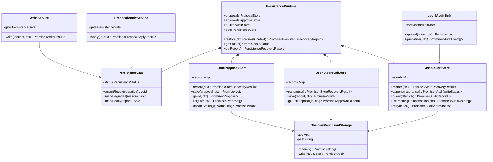
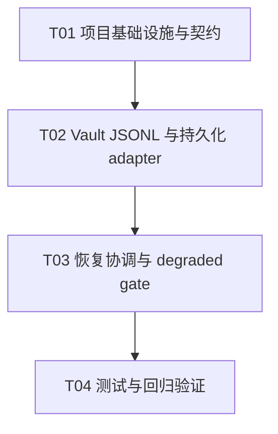

# Persistence Runtime Integration 增量架构

> 状态：仅架构设计，不修改业务源码。  
> 仓库：`E:/TT/workbuddy工作/2026-08-08-12-17-00`  
> 目标：把 Proposal/Approval/Audit 从生产运行时的内存实现切换为 Obsidian Vault 文本 JSONL 持久化，并建立可等待的恢复闸门。

## 1. Implementation Approach

### 1.1 现状与难点

当前 `composeRuntime()` 仍实例化 `InMemoryProposalStore`、`InMemoryApprovalStore`，并在 `WriteService` 中使用局部 `MemoryAuditSink`；Jsonl adapter 虽已存在，但没有 runtime wiring，也没有统一的启动恢复状态。`main.ts` 当前异步触发索引重建后立即完成启动，不能表达持久化是否已恢复。

本增量的难点是：

1. **恢复必须先于可变操作**：`runtime` 初始化必须 `await restore`；缺文件、空文件和单条损坏 JSONL 行是可容忍输入，Vault 读取/写入失败则进入 `degraded`。
2. **恢复失败不能伪造可写**：`degraded` 下允许查询已经恢复的内存快照，但 `apply`、目标 Markdown 写入、proposal/approval/audit 的持久化变更均被闸门拒绝；不自动 apply。
3. **独立 JSONL 行**：每一行是一个完整记录；一行 JSON 解析或字段校验失败只跳过该行并计入恢复报告，不能阻断其余合法记录。
4. **Obsidian API 边界**：持久化文件是受保护目录下的 Vault 文本文件，不使用 `child_process`、Hermes、shell、terminal、Node 文件系统或网络；业务 Markdown 仍只能经 `WritePort`/`WriteService` 写入。
5. **并发与一致性**：同一 JSONL 文件的 read-modify-write 必须串行；同一 proposal 的 apply 必须按 proposal key 串行，防止两个并发调用都通过审批检查。

### 1.2 选择与架构模式

- **语言/运行时**：继续使用仓库已有 TypeScript + Obsidian Vault API + esbuild；不增加第三方依赖。
- **模式**：端口-适配器（Hexagonal）+ 应用服务编排。`ProposalStore`、`ApprovalStore`、`AuditStore` 保持可替换，生产默认注入 JSONL adapter，测试仍可注入 InMemory adapter。
- **文本存储**：新增 `ObsidianVaultJsonlStorage` 实现 `JsonlTextStorage`。每类记录使用固定受保护 Vault 相对路径：`_inkmemory/runtime/proposals.jsonl`、`approvals.jsonl`、`audit.jsonl`。目录和文件不存在时通过 Vault API 创建；不得将这些文件当作业务 Markdown 交给 `ObsidianWritePort`。
- **恢复协调**：新增 `PersistenceRuntime`（或同等命名）持有三个 store、`PersistenceGate` 和 `PersistenceRecoveryReport`。`restore(context)` 依次恢复 proposal → approval → audit，汇总合法、损坏、重复和 pending-compensation 数量；所有 store 恢复完成后才把 gate 置为 `ready`。
- **运行时组合**：`composeRuntime` 改为 `async`，先构造并 `await persistence.restore(...)`，无论恢复成功与否都返回 runtime；失败被转换为 `degraded` 状态而非让插件崩溃。`WriteService` 与 `ProposalApplyService` 共享同一个 gate 和同一个 `ObsidianWritePort` 实例。
- **审计路径**：生产 `WriteService -> AuditService -> JsonlAuditSink -> JsonlAuditStore -> ObsidianVaultJsonlStorage`，删除 runtime 中 `MemoryAuditSink`。写入成功、冲突、失败都尝试记录；审计存储异常将 gate 置为 degraded，并返回明确错误，不报告完整成功。
- **不做的事**：不改 UI、搜索、organize 规则、Hermes、child_process/spawn/exec/shell/terminal，不改变自动 apply 规则，不扩展白名单，不把 runtime 恢复当作目标 Markdown apply。

## 2. File List

### 2.1 需要新增

- `src/adapters/obsidianVaultJsonlStorage.ts`：Vault 文本 JSONL 存储，负责受保护目录创建、读写和按路径串行化。
- `src/services/persistenceRuntime.ts`：三类 store 的恢复协调、恢复报告与生命周期状态。
- `src/services/persistenceGate.ts`：`ready/degraded` 变更闸门，供 write/apply/store 共享。
- `src/application/persistenceContracts.ts`：恢复状态、报告、持久化路径与持久化错误类型。
- `tests/persistenceJsonlAdapters.test.ts`：JSONL 恢复、坏行、重复记录、缺失/空文件和重启场景。
- `tests/persistenceRuntime.test.ts`：恢复状态机、degraded gate、并发和 retry 行为。
- `tests/runtimePersistenceIntegration.test.ts`：真实 runtime composition 不再使用生产 InMemory store、启动不自动 apply、写入链路审计。

### 2.2 需要修改

- `src/services/runtimeComposition.ts`：移除 `InMemoryProposalStore`、`InMemoryApprovalStore`、`MemoryAuditSink`；组装三个 Jsonl store、`JsonlAuditSink`、`PersistenceRuntime`，改为异步恢复后返回。
- `src/main.ts`：`await composeRuntime`；恢复失败仍注册只读能力但不触发 apply/write；索引 rebuild 可在恢复后启动且不写 Markdown。
- `src/services/writeService.ts`：注入 `PersistenceGate`（或等效 readiness port），在任何目标写入前检查；审计失败不得返回 applied。
- `src/services/proposalApplyService.ts`：注入 gate 和 keyed serial queue；degraded 时零 `WritePort` 调用，保持 approved 以便恢复后重试。
- `src/services/proposalService.ts`、`src/services/approvalService.ts`：使用可恢复 store；持久化异常向 gate 报告，不把未落盘状态视为成功。
- `src/services/auditService.ts`、`src/adapters/jsonlAuditSink.ts`：接入 `AuditStore` 的持久化结果和 pending-compensation/retry 语义。
- `src/adapters/jsonlStorage.ts`：保留通用 `JsonlTextStorage`，增加恢复报告/串行写入所需的可选能力，不再把 read 错误静默当成空文件。
- `src/adapters/jsonlProposalStore.ts`、`src/adapters/jsonlApprovalStore.ts`、`src/adapters/jsonlAuditStore.ts`：公开显式 `restore()`，缺文件/空文件正常，读取错误失败；逐行验证并报告损坏行。
- `src/application/contracts.ts`：补充 `PERSISTENCE_DEGRADED`、`PERSISTENCE_RECOVERY_FAILED`、`AUDIT_FAILED` 等错误码（保持现有业务联合类型兼容）。
- `package.json`：把新增 persistence 测试纳入默认 `npm test`；不增加第三方依赖。

### 2.3 明确不修改

`src/ui/**`、`src/views/**`、搜索和 organize 规则、Hermes/CLI/子进程相关代码、`overview.md`、`.workbuddy/**`、`handoff-prompt.md`、主分支配置。

## 3. Data Structures and Interfaces

### 3.1 持久化路径与恢复类型

```ts
export interface PersistencePaths {
  root: string;              // 默认 _inkmemory/runtime
  proposals: string;         // proposals.jsonl
  approvals: string;         // approvals.jsonl
  audit: string;             // audit.jsonl
}

export type PersistenceStatus = 'cold' | 'restoring' | 'ready' | 'degraded';

export interface PersistenceRecoveryReport {
  status: PersistenceStatus;
  proposals: { loaded: number; skipped: number; duplicates: number };
  approvals: { loaded: number; skipped: number; duplicates: number };
  audit: { loaded: number; skipped: number; duplicates: number; pending_compensation: number };
  warnings: string[];        // 不含记录正文/秘密内容
  error?: string;
}

export interface PersistenceGate {
  getStatus(): PersistenceStatus;
  getReport(): PersistenceRecoveryReport;
  assertReady(operation: 'apply' | 'write' | 'persist'): void;
  markDegraded(reason: string): void;
  markReady(report: PersistenceRecoveryReport): void;
}
```

`cold`/`restoring` 只存在于初始化期间；调用者不可绕过 gate。缺文件、空文件、坏行后仍为 `ready`（报告带 warning）；Vault I/O、无法创建目录、全部 store 恢复异常等进入 `degraded`。

### 3.2 JSONL 行 schema

每个文件每行一个独立 JSON 对象，不使用跨行数组。规范化写出时保留领域记录字段，并附以下元数据：

```ts
interface PersistedProposal extends Proposal {
  record_type: 'proposal';
  schema_version: 1;
  content_hash?: string;
  written_at?: string;
}
interface PersistedApproval extends ApprovalRecord {
  record_type: 'approval';
  schema_version: 1;
  content_hash?: string;
  written_at?: string;
}
interface PersistedAudit extends AuditRecord {
  record_type: 'audit';
  schema_version: 1;
  content_hash?: string;
  written_at?: string;
}
```

读取时 `record_type` 可对当前已有无该字段的合法记录兼容；若字段存在则必须匹配文件类型，`schema_version` 存在时必须为 `1`。必填字段和枚举仍按现有 `contracts.ts` 校验。`content_hash` 只用于记录完整性告警，不能替代 proposal 的 `base_hash`（后者仍需 apply 前重读目标 Markdown）。

- Proposal key=`proposal_id`：同 key 的合法行按文件顺序取最后一条，但禁止从 terminal 状态回退到非 terminal。
- Approval key=`proposal_id`：首条合法决定胜出，后续重复决定计数并忽略，保证首个 approve/reject 幂等。
- Audit key=`audit_id`：同 key 取最后一条状态（用于 retry），旧状态不覆盖新状态。
- 坏 JSON、错误类型、缺 key、错误枚举、错误 schema 均只跳过该行；不得因为单行损坏覆盖合法内存记录。

### 3.3 端口与服务

```ts
export interface JsonlTextStorage {
  read(context: RequestContext): Promise<string>; // 缺文件返回 ''
  write(value: string, context: RequestContext): Promise<void>;
}

export interface RestorableStore {
  restore(context: RequestContext): Promise<StoreRecoveryResult>;
}

export interface PersistenceRuntime {
  restore(context: RequestContext): Promise<PersistenceRecoveryReport>;
  getStatus(): PersistenceStatus;
  getReport(): PersistenceRecoveryReport;
  proposals: ProposalStore;
  approvals: ApprovalStore;
  audits: AuditStore;
  gate: PersistenceGate;
}

export class ObsidianVaultJsonlStorage implements JsonlTextStorage {
  constructor(app: App, path: string);
  read(context: RequestContext): Promise<string>;
  write(value: string, context: RequestContext): Promise<void>;
}
```

`JsonlProposalStore`/`JsonlApprovalStore`/`JsonlAuditStore` 实现对应现有 port，并额外实现 `RestorableStore.restore`。所有公开方法仍携带 `RequestContext`。`AuditService` 仍是 `WriteService` 的边界，不允许业务服务直接操作 Vault。



## 4. Program Call Flow

### 4.1 启动和恢复

1. `main.onload` 加载 settings，`await composeRuntime(app, settings)`。
2. composition 创建三份 Vault JSONL storage、三份 Jsonl store、共享 write port、gate 和 services。
3. `PersistenceRuntime.restore` 将 gate 置为 `restoring`，逐一调用 store.restore；缺失/空文件转为空集合，坏行累计 warning。
4. 任一 Vault I/O 或不可恢复错误时记录 `error` 并把 gate 置为 `degraded`；不抛出到插件顶层。合法部分仍可查询。
5. 全部完成且无 I/O 错误时 gate=`ready`；查询 pending proposal 和 pending-compensation 仅返回状态，不执行 apply/retry。
6. `main` 注册 view/events，然后可启动 `lifecycle.rebuild`；rebuild 只更新内存索引，**不得自动调用 `ProposalApplyService.apply`**。

### 4.2 Proposal/Approval/Audit 与 apply

```mermaid
sequenceDiagram
  participant Main as main.onload
  participant RT as PersistenceRuntime
  participant PS as JsonlProposalStore
  participant AS as JsonlApprovalStore
  participant ATS as JsonlAuditStore
  participant Gate as PersistenceGate
  participant Apply as ProposalApplyService
  participant Write as WriteService
  participant Port as ObsidianWritePort
  participant Sink as JsonlAuditSink

  Main->>RT: restore(startupContext)
  RT->>Gate: status=restoring
  RT->>PS: restore(ctx)
  PS-->>RT: loaded/skipped report
  RT->>AS: restore(ctx)
  AS-->>RT: loaded/skipped report
  RT->>ATS: restore(ctx)
  ATS-->>RT: loaded/skipped/pending report
  alt all I/O succeeded
    RT->>Gate: markReady(report)
  else any I/O/recovery failure
    RT->>Gate: markDegraded(reason)
  end
  RT-->>Main: runtime + report
  Main->>Main: rebuild index only; no auto apply

  Apply->>Gate: assertReady(apply)
  alt degraded/restoring
    Gate-->>Apply: reject PERSISTENCE_DEGRADED
    Apply-->>Main: failed/skipped, zero WritePort calls
  else ready
    Apply->>PS: get(proposalId, ctx)
    PS-->>Apply: approved proposal
    Apply->>AS: getForProposal(proposalId, ctx)
    AS-->>Apply: approve record
    Apply->>Port: read(targetPath, childCtx)
    Port-->>Apply: current Markdown
    Apply->>Apply: compare SHA-256 base_hash
    alt conflict
      Apply->>PS: updateStatus(conflict)
      Apply-->>Main: conflict; no write
    else hash matches
      Apply->>Write: write(WriteRequest, ctx)
      Write->>Gate: assertReady(write)
      Write->>Port: writeAtomic(targetPath, after)
      Write->>Port: read(targetPath)
      Write->>Sink: append(auditEvent, childCtx)
      Sink->>ATS: append(auditRecord, childCtx)
      ATS-->>Sink: success/failure
      Sink-->>Write: persisted/throw
      Write-->>Apply: WriteResult
      Apply->>PS: updateStatus(applied|failed)
      Apply-->>Main: result; no second apply
    end
  end
```

## 5. 恢复状态机与降级/阻断

```text
cold --compose--> restoring
restoring --缺文件/空文件/坏行可跳过--> ready (带 warnings)
restoring --Vault read/create/modify 失败--> degraded
ready --任一持久化写失败--> degraded
ready --apply/write--> 允许进入现有 hash/zone/whitelist 安全链路
degraded --query/list--> 允许已恢复快照只读查询
degraded --apply/write/persist--> 拒绝，零目标 Markdown 写调用
```

- `degraded` 不自动修复、不自动 apply；用户后续显式 retry/重新初始化成功后才可恢复 `ready`。
- `ProposalApplyService` 在 gate 检查失败时返回 `failed` + `PERSISTENCE_DEGRADED`（或等价错误），proposal 保持 `approved`，避免恢复后丢失待办。
- `WriteService` 在调用 `WritePort.writeAtomic` 前检查 gate；任何 gate 拒绝均不得调用目标写入。审计持久化失败不得把结果改写为 `applied`，并应把运行时置为 degraded。
- 关闭 `new_write_pipeline` 或 `organize_auto_apply` 时沿用现有 flags；持久化恢复绝不改变开关语义。
- 失败原因只进入状态/审计摘要，不把 proposal 正文写入日志或错误消息。

## 6. 并发、幂等与原子性边界

- **每路径串行**：`ObsidianVaultJsonlStorage` 维护 `Map<path, Promise<void>>`，同一路径的 `write` 等待前一写完成；store 的 map 更新与 flush 在同一串行段内执行。
- **每 proposal 串行**：`ProposalApplyService` 维护 keyed queue；同一 proposal 的第二次 apply 等待第一次结束后重新读取状态，若已 applied/terminal 则拒绝，不重复写。
- **Approval 首决策**：`JsonlApprovalStore.save` 在 map 已有 proposal key 时返回幂等 no-op，不覆盖首条决定。
- **读写快照**：flush 将当前合法 map 序列化为每行一对象并以换行结尾；恢复时只使用合法行，重复 key 按上文规则解析。
- **Vault 原子性声明**：Obsidian `vault.modify` 是单文件 API，不承诺跨平台 fsync、临时文件 rename 或崩溃级原子提交；本设计只承诺进程内串行和业务层 before-hash 防护，不声称平台级原子性。
- **目标文件边界**：JSONL 文件由专用 Vault 文本 adapter 写入；业务 Markdown 仍只由 `ObsidianWritePort`/`WriteService` 写，且 apply 前后均遵守 hash、zone 和 whitelist 检查。
- **跨进程限制**：不处理多个 Obsidian 进程同时写同一 Vault 的锁；检测到外部修改导致解析/哈希异常时进入 degraded 或返回 conflict。

## 7. 测试矩阵

| 类别 | 场景 | 关键断言 |
|---|---|---|
| adapter recovery | 缺失、空 proposal/approval/audit 文件 | restore 成功，计数为 0，不抛异常 |
| adapter recovery | 合法行 + 损坏 JSON 行 + 错字段行 | 合法记录可读；坏行跳过并计数/warning |
| adapter recovery | 重复 proposal、重复 approval、重复 audit | proposal/audit 确定性去重；approval 保留首决定 |
| adapter CRUD | save/get/list/updateStatus、append/query/retry | 重启新实例可读取；状态过滤和 retry 正确 |
| runtime wiring | composeRuntime 生产默认构造 | 无 InMemoryProposal/Approval/AuditSink；三 store 共享 Vault storage 配置 |
| startup | `await composeRuntime` 后模拟恢复 | restore 完成后再暴露 runtime；不调用 apply；rebuild 不写 Markdown |
| degraded gate | 任一 storage.read/create/modify 失败 | runtime 返回 degraded；apply/write 返回明确错误；目标 `writeAtomic` 调用次数为 0 |
| persistence failure | store flush 失败、audit append 失败 | 不返回持久化成功；gate 变 degraded；pending-compensation/failed 可查询和 retry |
| apply safety | approved + base hash conflict、fiction/unknown、重复 apply | conflict/零写；proposal-only 零写；重复 apply 不再调用 WritePort |
| concurrency | 同一 proposal 两次并发 apply；同一 JSONL 两次并发 flush | 只允许一次目标写；JSONL 不交错且可完整恢复 |
| regression | 现有 search/index/organize/write 测试 | 全部原有测试通过，关闭新写开关时不产生业务 Vault 写 |
| quality | `npm test`、`npm run build`、`npm run lint`、`tsc --noEmit`、`git diff --check` | 全部通过；新增测试纳入默认 test script |

## 8. Required Packages

不新增第三方包。继续使用现有：

- `typescript@^5.8.3`：类型检查与编译。
- `obsidian@latest`：Vault 文本 API 与插件生命周期。
- `esbuild@0.25.5`：插件打包。
- `node:test`、`node:assert/strict`、`node:crypto`：现有测试与 SHA-256 工具（Node 内置）。

## 9. Task List（按依赖排序）

### T01：项目基础设施与运行时契约

- **Source Files**：`package.json`、`src/application/contracts.ts`、`src/application/persistenceContracts.ts`、`src/main.ts`、`src/services/runtimeComposition.ts`
- **Dependencies**：无
- **Priority**：P0
- **内容**：定义持久化状态/错误/路径契约，更新默认测试入口；把 runtime composition/onload 接口改成可等待恢复的基础形态，保留 flags 和无自动 apply 约束。

### T02：Vault JSONL 存储与三个持久化 adapter

- **Source Files**：`src/adapters/obsidianVaultJsonlStorage.ts`、`src/adapters/jsonlStorage.ts`、`src/adapters/jsonlProposalStore.ts`、`src/adapters/jsonlApprovalStore.ts`、`src/adapters/jsonlAuditStore.ts`、`src/adapters/jsonlAuditSink.ts`
- **Dependencies**：T01
- **Priority**：P0
- **内容**：实现受保护 Vault 文本路径、每行独立 JSON、坏行跳过/报告、缺失/空文件处理、重复/幂等规则和按路径串行 flush；所有 I/O 传递 `RequestContext`。

### T03：恢复协调、degraded gate 与安全写/apply 接入

- **Source Files**：`src/services/persistenceRuntime.ts`、`src/services/persistenceGate.ts`、`src/services/runtimeComposition.ts`、`src/services/writeService.ts`、`src/services/proposalApplyService.ts`、`src/services/proposalService.ts`、`src/services/approvalService.ts`、`src/services/auditService.ts`
- **Dependencies**：T02
- **Priority**：P0
- **内容**：`await restore`、状态机、失败降级、apply/write 零写阻断、同一 proposal 串行、生产 runtime 完全移除 InMemory 默认实现；保持目标 Markdown 的原有安全链路。

### T04：恢复/集成/并发测试与回归验证

- **Source Files**：`tests/persistenceJsonlAdapters.test.ts`、`tests/persistenceRuntime.test.ts`、`tests/runtimePersistenceIntegration.test.ts`、`tests/proposalAuditQa.test.ts`、`package.json`
- **Dependencies**：T03
- **Priority**：P0
- **内容**：覆盖缺失/空文件、损坏行、重启、degraded、审计失败、重复 apply、并发 flush、无自动 apply 和生产 wiring；运行 test/build/lint/tsc/diff-check。

## 10. Shared Knowledge

- 所有应用 API/服务结果继续遵循 `{ code, data, message, request_id? }` envelope；持久化内部报告不得泄漏记录正文。
- 所有持久化 I/O 必须带 `RequestContext`，子操作使用 `context.child()`；时间统一 ISO 8601 UTC。
- Vault Markdown 是业务事实源；JSONL 只保存 proposal、approval、audit 元数据和恢复队列，不参与搜索索引，不覆盖业务 Markdown。
- 生产组合禁止 `InMemoryProposalStore`、`InMemoryApprovalStore`、`InMemoryAuditStore`、`MemoryAuditSink`；测试可以显式注入内存 fake。
- 启动恢复只 restore/list/retry metadata，不自动 approve、apply、写 Markdown 或刷新业务内容。
- `fiction`/`unknown` 仍 proposal-only；所有现有 whitelist、before-hash、index lifecycle 与 feature flag 安全边界必须保留。
- 不使用 Hermes、`child_process`、`spawn`、`exec`、shell、terminal，也不读取/修改 `.workbuddy/`、`overview.md` 或主分支。

## 11. Task Dependency Graph



## 12. 本轮真实实现顺序（给 Engineer 的执行契约）

以下顺序以仓库当前事实为准：`runtimeComposition` 的真实路径是 `src/services/runtimeComposition.ts`，而不是 `src/runtimeComposition.ts`；`main.ts` 当前以同步 `composeRuntime()` 得到 runtime 后再 fire-and-forget rebuild，必须先修复这一启动边界。

| 顺序 | 实现步骤 | 必须满足的可观测结果 | 依赖 |
|---|---|---|---|
| 1 | 定义 `PersistenceStatus`、恢复报告、`PersistenceGate` 错误语义；将 `RuntimeServices` 扩展为暴露 `persistence` | cold → restoring → ready/degraded 状态可查询；degraded 原因不含正文/秘密 | 无 |
| 2 | 为三类 JSONL adapter 增加显式 `restore(context)` 和逐行校验；明确缺文件/空文件/坏行处理 | 缺文件/空文件不抛错；坏 JSONL 行只跳过并计数；Vault read/create/modify 错误不再静默为空 | 1 |
| 3 | 增加恢复协调器：按 proposal → approval → audit 顺序 restore，汇总 pending proposal 与 pending-compensation | 合法记录可查询；重复 proposal/audit 确定性收敛，approval 保留首决定；任一不可恢复 I/O 进入 degraded | 2 |
| 4 | 修改 `composeRuntime` 为 `async`，创建并注入同一批 storage/store/gate/writePort | ProposalService、ApprovalService、ProposalApplyService、WriteService 和 AuditSink 不再使用生产内存实现；全链路共享实例 | 3 |
| 5 | 修改 `main.onload` 为 `await composeRuntime`，在恢复完成后再注册可变入口；仅启动索引 rebuild | 启动不自动 approve/apply/retry，不写业务 Markdown；基础 dashboard/search 即使 degraded 仍可用 | 4 |
| 6 | 在 approval/apply/write/persist 入口统一检查 gate；将审计写失败转换为 pending-compensation/failed 并置 degraded | degraded 时 approve、apply、目标 Markdown write、持久化写均被阻断；零 `writeAtomic` 调用；proposal 保持可恢复状态 | 4、5 |
| 7 | 补齐真实 runtime 重启集成测试及回归命令 | 新 runtime 从同一 JSONL 恢复 pending proposal、approval、audit；无自动 apply；全部 test/build/lint/tsc/diff-check 通过 | 1–6 |

> **实现顺序约束**：不得先改 `main.ts` 的 await 而没有恢复状态与 gate；不得先接入 JSONL store 而没有显式 restore 结果；不得以“读文件异常当空文件”掩盖恢复失败。每一步完成后保留原有 hash、zone、whitelist、feature flag 边界。

## 13. 验收重点（最小可验收闭环）

1. **可恢复**：在同一临时 Vault 中创建 proposal + approval + audit，销毁 runtime 后新建 runtime；`await restore` 返回后，pending/approved/审计记录和 pending-compensation 均可按 request_id 查询，状态不回退、不重复。
2. **安全降级**：注入任一 storage 的 read/create/modify 失败，runtime 仍完成基础启动并报告 `degraded`；approve/apply/write/persist 入口均拒绝，目标 Markdown 的 `WritePort.writeAtomic` 调用次数为 0；search/index/dashboard 仍能服务已恢复快照。
3. **输入容错**：缺文件、空文件、合法行 + 坏 JSONL 行分别验证；坏行只计数/告警，合法行仍可读取；重复 proposal/audit 取最后合法状态且不允许 terminal 回退，重复 approval 保留首条决定。
4. **启动边界**：`main.onload` 必须 `await composeRuntime`；恢复完成前不得暴露可变操作；恢复后只做 index rebuild，不触发 approve/apply/retry，不新增业务 Markdown 写入。
5. **共享实例**：断言生产 composition 中 Proposal/Approval/Audit store、AuditSink、WriteService、ProposalApplyService 使用同一配置/实例，且不存在 `MemoryAuditSink`、`InMemoryProposalStore`、`InMemoryApprovalStore` 默认路径。
6. **审计真实性**：write 的 success/conflict/failure 都经过持久化 AuditStore；审计落盘失败不能返回 applied，必须留下 pending-compensation 或明确 failed 状态，重启后可发现并 retry。
7. **边界回归**：`new_write_pipeline=false` 时不产生业务 Vault 写；fiction/unknown 仍 proposal-only；不引入 Hermes、child_process、shell、terminal 或 Node 文件系统。

## 14. Anything UNCLEAR / 未决风险

1. **Vault 文件扩展名**：当前 `ObsidianWritePort` 只允许 `.md`，专用 JSONL adapter 应直接使用 Vault API 接受 `.jsonl`；若 Obsidian 版本不允许该扩展名，需要改为受保护 `.md` 文本文件，但不能复用业务 WritePort。
2. **目录创建竞争**：多个 runtime/插件事件首次写入时可能同时创建目录；adapter 必须把“已存在”视为幂等成功，并通过路径队列避免交错。
3. **缺文件语义**：设计把缺文件视为空集合并允许创建；若宿主 Vault 为只读，应报告 degraded，而不能把缺文件静默标成 ready 后继续 apply。
4. **审计写入与目标写入的跨文件事务**：Vault API 不提供跨文件事务。目标 Markdown 已写而 audit flush 失败时只能返回 failed、置 degraded 并记录可恢复告警，不能宣称回滚或完整原子提交；后续可增加双写/补偿，但不属于本次最小接入。
5. **跨进程并发**：进程内队列无法解决多个 Obsidian 进程并发修改同一 JSONL 的问题；本轮不引入 fs 锁或 Node 文件系统。
6. **现有 schema 兼容**：当前 `Proposal` 有 `schema_version`，`ApprovalRecord`/`AuditRecord` 没有；读取应兼容缺少新增元字段的既有合法行，写出统一补齐 `record_type/schema_version/written_at`，避免升级时丢失待审批记录。
7. **恢复错误可见性**：本轮不改 UI；degraded/recovery warning 应通过 `RuntimeServices.persistence`/日志接口供后续状态展示，不能依赖 UI 才阻断写入。
