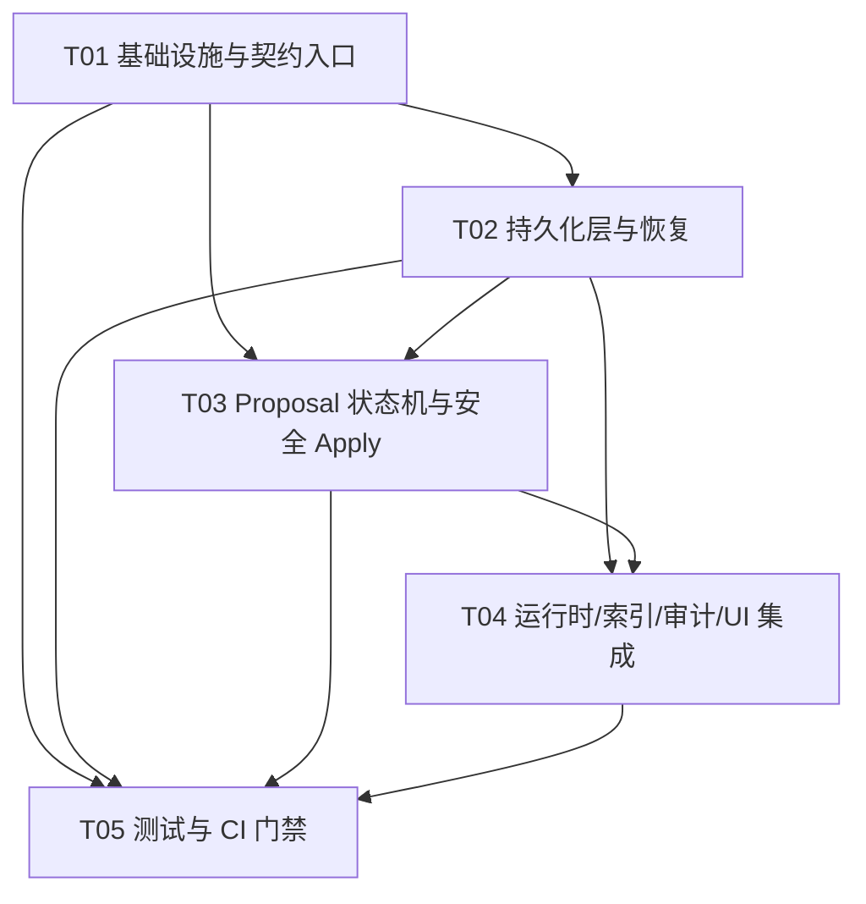

# V0.2 Proposal / Audit Closure 架构

> **文档性质：目标架构/历史方案。** 下文的 CAS、`applying` 崩溃恢复、双端补偿和全路径 WriteService 是验收目标；当前实现状态见 [`AGENT-HANDOFF-PROMPT.md`](AGENT-HANDOFF-PROMPT.md)。

> 状态：增量架构设计（仅文档，不修改业务源码）  
> 适用仓库：历史设计 checkout（具体机器路径不作为当前路径）
> 目标：在已有 V0.2 只读扫描、整理计划、受限写入、索引生命周期和 `RequestContext` 基础上，补齐 proposal 持久化、单条审批、apply 前 hash 重读、审计持久化和重启恢复。

## 1. 现状判断

### 1.1 已具备能力

- `OrganizeService.plan()` 已扫描 scope，生成四类白名单 `PlannedChange`（frontmatter、tag、双向链接、format），并以 `before_hash` 绑定扫描时内容。
- `ScopeService` 已提供 scope snapshot、排除路径和范围判断；`fiction` / `unknown` 已由计划标为 `proposal_only`。
- `WriteService` 已统一经过 `WritePort`，在写前重新读取并 SHA-256 校验，支持白名单、dry-run、hash conflict、写后 hash、索引刷新和结构化审计。
- `ObsidianWritePort` 仅接受 Markdown 相对路径，当前通过 Vault API `modify` 写入；业务层没有直接调用 Obsidian 全局对象。
- `IndexLifecycleService` 已提供 create/modify/delete/rename/rebuild、全局队列和按路径串行化，失败状态不会伪报 ready。
- `RequestContext` 已提供 `request_id`、actor、parent 链路；默认 FeatureFlags 中新写入和 auto apply 均关闭。
- Dashboard 目前已有关键词搜索、snippet、原文打开和索引状态展示，可作为审批/审计入口的宿主。

### 1.2 当前缺口（本增量必须解决）

1. `OrganizePlan` 尚未落为持久化 `Proposal` 记录；重启后无待审批队列。
2. `AuditService` 当前依赖 `MemoryAuditSink`，数据只在进程内，无法恢复或查询历史。
3. 尚无严格的 proposal 状态机和单条 approve/reject API；`WriteService.write()` 不能独立证明“已审批且只消费一次”。
4. apply 需要从已持久化 proposal 重读当前 Markdown，并比较 `base_hash`；`fiction` / `unknown` 必须在写端再次强制零写入，而不是只信任 UI/plan。
5. 损坏 JSON/记录必须跳过并留下可查询的恢复告警，不能因一条坏记录阻塞全部恢复。
6. 索引刷新失败、审计一端失败、WritePort 失败需要明确最终状态和补偿路径；重复 apply 必须被幂等拒绝。

### 1.3 不在本增量范围

- 不接入 Hermes、CLI、`child_process`、`spawn`、shell、terminal。
- 不开放批量 approve/apply、自动迁移旧记录、回滚 UI、后台研究、网络外发。
- 不改变 Vault Markdown 事实源；不把内存索引、模型结果或审计副本当作事实源。
- 不修改 `.workbuddy/`、`overview.md`；不提交、push、merge。
- 不新增第三方依赖；使用 TypeScript、Obsidian Vault API 和现有 SHA-256 工具。

## 2. 实现方案与边界

### 2.1 架构

采用端口-适配器（Hexagonal）加应用服务编排：

```text
AgentDashboardView / main.ts
  -> ProposalService (plan, query, approve, reject, apply)
  -> ProposalStore / AuditStore (持久化端口)
  -> WriteService
  -> WritePort -> ObsidianWritePort -> Obsidian Vault
  -> IndexLifecycleService.modify()
  -> AuditService -> AuditStore
```

- `OrganizeService` 只生成计划，不写文件。
- `ProposalService` 是唯一审批和 apply 编排入口；UI 不可直接构造 `WriteRequest` 绕过 proposal。
- `WriteService` 仍是所有 Markdown 写入的安全门：重新读文件、校验 path/zone/kind/base hash、调用 `writeAtomic`、校验 after hash、刷新索引并返回明确状态。
- `ProposalStore`、`AuditStore` 都是可替换端口。最小实现采用“本地插件数据主记录 + Vault `_workbench/` 镜像”的双写适配器；一端失败时记录 `pending-compensation`，启动时从完整端补偿，不能静默成功。
- 适配器不得使用 Node 文件系统、终端或 Hermes CLI；由宿主提供 `loadData/saveData` 或 Vault API 的异步实现。

### 2.2 状态机

#### Proposal 状态

```text
pending_approval --approve--> approved --apply--> applying
pending_approval --reject--> rejected
approved --reject--> rejected              (未 apply 时允许撤销)
applying --写成功+索引成功+审计成功--> applied
applying --base_hash 不同--> conflict
applying --fiction/unknown 或策略拒绝--> blocked
applying --WritePort/after-hash 失败--> failed
applying --索引失败--> applied_index_pending
approved --过期--> expired
applied / rejected / conflict / blocked / failed / applied_index_pending --> terminal
```

规则：

- 只有 `pending_approval` 可 approve；只有 `pending_approval` 或 `approved` 可 reject。
- 只有 `approved` 可进入 apply；`applied`、`applying` 以及全部 terminal 状态的再次 apply 都返回 `DUPLICATE_APPLY` 或对应 terminal 状态，绝不再调用 `WritePort`。
- `fiction`、`unknown` 在创建、审批、apply 三处均检查；它们只能形成/保留 proposal，不产生任何 Markdown 写调用。状态使用 `blocked`，错误码 `PROPOSAL_ONLY_ZONE`。
- `applied_index_pending` 表示文件已经安全写入但派生索引未刷新；不得伪报完整成功，可通过恢复任务重试索引并追加审计。

#### Audit 状态

`pending` → `committed`；任一持久端失败为 `pending-compensation`；两端均确认失败为 `failed`。审计 append 使用 `audit_id` 作为幂等键，查询结果保留状态、错误码和端点信息。

### 2.3 持久化与损坏记录策略

- 记录包统一带 `schema_version`、`record_type`、`content_hash`、`payload`、`written_at`；hash 对规范化 JSON payload 计算。
- Proposal、Approval、Audit 记录分别以数组/映射存储，但适配器对每一条独立解析与校验；单条 parse、schema、hash 或枚举失败只生成 `CORRUPT_RECORD_SKIPPED` 恢复事件并跳过。
- 恢复顺序：读取本地端和 Vault 镜像 → 验证记录 → 以 `record_id` 去重 → 选 hash 一致的最新版本 → 补偿缺失端 → 重建内存索引。不能用坏记录覆盖好记录。
- proposal 的状态更新采用 compare-and-set（期望旧状态 + 版本号），写入串行队列；CAS 失败返回 `STALE_PROPOSAL`。
- 所有时间使用 ISO 8601 UTC；路径为规范化 Vault 相对路径，禁止 `..`、绝对路径和非 `.md` 写目标。

## 3. 文件清单

### 3.1 现有文件（修改点）

- `src/application/contracts.ts`：补充 Proposal、Approval、AuditRecord、StoreQuery、错误码和结果联合类型。
- `src/application/requestContext.ts`：保持 request/parent 传播；必要时为 store 操作创建 child context。
- `src/application/featureFlags.ts`：保持 `new_write_pipeline=false`、`organize_auto_apply=false`；不以 flag 绕过 proposal 审批。
- `src/services/organizeService.ts`：为每个 `PlannedChange` 生成稳定 proposal 输入，保留 scope snapshot 和 zone。
- `src/services/writeService.ts`：增加 proposal apply 所需的状态/zone/路径/kind 二次校验和明确失败结果；维持现有 WritePort 边界。
- `src/services/auditService.ts`：从内存 sink 切换至 AuditStore，提供 append/query/recover 和幂等 append。
- `src/services/indexLifecycleService.ts`：复用 `modify`，对索引刷新失败返回可恢复状态，不回写 Markdown。
- `src/services/runtimeComposition.ts`：组装持久化 ProposalStore、AuditStore、ProposalService；去除仅用于运行时的 MemoryAuditSink。
- `src/main.ts`：插件启动时恢复 stores，按恢复结果注册服务；不自动 apply，不在恢复阶段写目标 Markdown。
- `src/views/AgentDashboardView.ts`：增加只读 proposal 查询、单条 approve/reject/apply 操作和状态/错误展示；所有按钮调用 ProposalService。
- `src/ports/writePort.ts`、`src/adapters/obsidianWritePort.ts`：保持并强化 Markdown path 校验；不引入终端或直接文件系统。

### 3.2 新增文件（建议）

- `src/ports/proposalStore.ts`：Proposal/Approval 持久化端口。
- `src/ports/auditStore.ts`：Audit 持久化、查询、恢复端口。
- `src/ports/recordStore.ts`：通用 record envelope、双端读写/补偿抽象（若实现者选择拆分）。
- `src/services/proposalService.ts`：plan → persist、query、approve/reject、apply 状态机。
- `src/adapters/persistentProposalStore.ts`：本地 + Vault mirror proposal/approval 存储，坏记录隔离。
- `src/adapters/persistentAuditStore.ts`：本地 + Vault mirror audit 存储，坏记录隔离与幂等 append。
- `src/adapters/obsidianRecordStore.ts`：受保护 `_workbench/proposals|approvals|audit` 目录的 Vault API 适配（不写业务 Markdown）。
- `tests/proposalService.test.ts`：状态机、hash conflict、zone zero-write、幂等。
- `tests/persistentStores.test.ts`：双端持久化、损坏记录跳过、query、补偿。
- `tests/proposalRecovery.test.ts`：重启恢复、重复 apply、索引/审计失败状态。
- `tests/v02ProposalAuditClosure.test.ts`：端到端 use-case 契约回归。

## 4. 数据结构与接口

### 4.1 Proposal schema

```ts
export type ProposalStatus =
  | 'pending_approval' | 'approved' | 'rejected' | 'applying'
  | 'applied' | 'applied_index_pending' | 'conflict'
  | 'blocked' | 'failed' | 'expired';

export interface ProposalRecord {
  schema_version: 1;
  proposal_id: string;
  request_id: string;
  plan_id: string;
  target_path: string;
  zone: 'normal' | 'fiction' | 'unknown';
  kind: ChangeKind;
  before_hash: string;       // apply 时的 base_hash
  patch: string;              // 可展示/可重放 diff
  before_content: string;     // 最小回滚/审计快照（可按策略脱敏）
  after_content: string;      // WriteService 的候选内容
  reason: string;
  model?: { provider: string; name: string };
  created_at: string;
  expires_at?: string;
  status: ProposalStatus;
  version: number;            // CAS 版本
  updated_at: string;
  content_hash: string;       // 规范化 payload hash
}

export interface ApprovalRecord {
  schema_version: 1;
  approval_id: string;
  proposal_id: string;
  request_id: string;
  decision: 'approve' | 'reject';
  actor: 'user';
  note?: string;
  decided_at: string;
  content_hash: string;
}
```

`before_content`/`after_content` 必须只由 `OrganizeService` 产生，apply 时不得接受 UI 修改后的内容；若需修改需重新生成 proposal。`content_hash` 不替代 `before_hash`：前者保护记录完整性，后者保护目标 Markdown 未被外部修改。

### 4.2 Audit schema

```ts
export type AuditResult =
  | 'success' | 'conflict' | 'blocked' | 'failed'
  | 'pending-compensation' | 'index-pending' | 'corrupt-record-skipped';

export interface AuditRecord {
  schema_version: 1;
  audit_id: string;
  request_id: string;
  proposal_id?: string;
  target_path?: string;
  action: ChangeKind | 'approve' | 'reject' | 'recover' | 'index-refresh';
  actor: 'user' | 'workbench-agent' | 'background-task';
  before_hash?: string;
  after_hash?: string;
  result: AuditResult;
  error_code?: string;
  endpoint_status?: { local: 'committed' | 'failed'; vault: 'committed' | 'failed' };
  created_at: string;
  content_hash: string;
}
```

### 4.3 Port/service signatures

```ts
export interface ProposalStore {
  save(record: ProposalRecord, ctx: RequestContext): Promise<StoreWriteResult>;
  get(proposalId: string, ctx: RequestContext): Promise<ProposalRecord | null>;
  query(filter: ProposalQuery, ctx: RequestContext): Promise<ProposalRecord[]>;
  compareAndSet(proposalId: string, expected: { status: ProposalStatus; version: number }, next: ProposalRecord, ctx: RequestContext): Promise<StoreWriteResult>;
  saveApproval(record: ApprovalRecord, ctx: RequestContext): Promise<StoreWriteResult>;
  recover(ctx: RequestContext): Promise<RecoveryReport>;
}

export interface AuditStore {
  append(record: AuditRecord, ctx: RequestContext): Promise<StoreWriteResult>;
  query(filter: AuditQuery, ctx: RequestContext): Promise<AuditRecord[]>;
  recover(ctx: RequestContext): Promise<RecoveryReport>;
  compensate(recordId: string, ctx: RequestContext): Promise<StoreWriteResult>;
}

export interface ProposalService {
  createFromPlan(plan: OrganizePlan, ctx: RequestContext): Promise<ProposalRecord[]>;
  query(filter: ProposalQuery, ctx: RequestContext): Promise<ProposalRecord[]>;
  approve(proposalId: string, input: { note?: string }, ctx: RequestContext): Promise<ProposalResult>;
  reject(proposalId: string, input: { note?: string }, ctx: RequestContext): Promise<ProposalResult>;
  apply(proposalId: string, ctx: RequestContext): Promise<ProposalResult>;
  recover(ctx: RequestContext): Promise<RecoveryReport>;
}

export interface WritePort {
  read(path: string, ctx: RequestContext): Promise<string>;
  writeAtomic(path: string, content: string, ctx: RequestContext): Promise<void>;
}
```

`StoreWriteResult` 必须包含 `status: 'committed' | 'pending-compensation' | 'failed'`、记录 ID、端点状态和可读 `error_code`。`ProposalResult` 必须携带 proposal 当前状态、`request_id`、是否调用写端及 `WriteResult`/refresh 详情。

## 5. 关键调用时序

完整 Mermaid 源码见 [`V0.2-PROPOSAL-AUDIT-CLOSURE-SEQUENCE.mermaid`](./V0.2-PROPOSAL-AUDIT-CLOSURE-SEQUENCE.mermaid)。核心顺序：

1. `main.onload` 组装 adapters/services，先 `ProposalService.recover()`、`AuditStore.recover()`；坏记录跳过，待补偿记录入队；不触碰业务 Markdown。
2. UI 调用 `OrganizeService.plan()`，得到 `OrganizePlan`；`ProposalService.createFromPlan()` 将每个 change 持久化，fiction/unknown 仍只进入 `blocked`/proposal-only 语义。
3. UI 只能对单个 `proposal_id` 调 `approve` 或 `reject`。服务以 CAS 检查旧状态，持久化 `ApprovalRecord`，更新 proposal，并追加审批审计。
4. `apply` 再从 ProposalStore 读取，而不是信任 UI 缓存；CAS 将 `approved` 改为 `applying`，随后通过 `WriteService`/`WritePort.read` 重读 Markdown、算当前 hash。
5. hash 不等则 `conflict`，不调用 `writeAtomic`；fiction/unknown 或路径/kind 不合规则 `blocked`，同样零写入。
6. 合规时调用 `writeAtomic`，再读 after hash；调用 `IndexLifecycleService.modify`。索引失败为 `applied_index_pending`，写入已经发生但结果明确为待刷新。
7. append `AuditRecord`。双端都成功才将 proposal 标为 `applied`；任一端失败为 `pending-compensation`/`failed`，UI 显示失败，不返回成功。
8. 重复 apply 读取 terminal/applied 状态并拒绝，写审计 `DUPLICATE_APPLY`，`WritePort.writeAtomic` 次数保持为零。

## 6. 恢复、失败与并发策略

### 6.1 启动恢复

- 恢复必须在注册可操作 UI 前完成或以 `restoring` 状态显式展示；失败不阻塞 Dashboard 只读能力。
- 两端记录按 `record_id + content_hash` 验证。坏记录逐条跳过，保留 `corrupt-record-skipped` audit/diagnostic；不能因 `JSON.parse` 异常中止启动。
- 本地和 Vault 内容 hash 一致时去重；只有一端存在时补写缺失端；两端均不一致时保留两份并标 `pending-compensation`，禁止猜测覆盖。
- `applying` 的 proposal 是崩溃中断遗留：恢复时根据目标当前 hash 与 `before_hash`/`after_hash` 判断。无法证明写入完成则回到 `failed` 并要求人工重试，绝不自动再次写入。
- `approved` 保持待 apply；`pending_approval` 保持待审批；terminal 状态不可重新执行。

### 6.2 并发与幂等

- Proposal 状态修改使用版本号 CAS；同一 proposal 的 approve/reject/apply 通过 per-proposal Promise queue 串行化。
- Apply 通过 target-path lock 与 IndexLifecycle 全局队列串行，避免两个 proposal 同时覆盖同一 Markdown。不同路径可并行创建/审批，但写操作仍受现有生命周期队列保护。
- 幂等键：`proposal_id`（业务 apply）、`approval_id`（审批）、`audit_id`（审计 append）；已存在且 payload hash 相同时返回已提交，不重复副作用；同 ID 不同 payload 返回 `IDEMPOTENCY_KEY_REUSED`。
- apply 先 CAS `approved → applying`，因此第二个并发请求必然得到 `STALE_PROPOSAL`/`DUPLICATE_APPLY`，不会进入 WritePort。
- `request_id` 用于一次用户操作的关联，不作为重复 apply 的唯一键；子调用使用 child context 并保留 parent。

### 6.3 明确失败状态

| 失败点 | Proposal 状态 | 审计 result | 是否写 Markdown |
|---|---|---|---|
| 记录损坏 | 不加载 | `corrupt-record-skipped` | 否 |
| 未审批/重复 apply | 保持原 terminal | `failed`（错误码明确） | 否 |
| fiction/unknown/策略拒绝 | `blocked` | `blocked` | 否 |
| base hash 冲突 | `conflict` | `conflict` | 否 |
| WritePort 读/写/after hash 失败 | `failed` | `failed` | 写失败时否；写后校验失败需人工核对 |
| index refresh 失败 | `applied_index_pending` | `index-pending` | 是（仅此步骤已成功） |
| local/vault audit 一端失败 | `applied` + 补偿标志或 `pending-compensation`（实现统一） | `pending-compensation` | 不回滚已成功写入 |

建议对外统一 `{ code, data, message, request_id }` envelope，错误码至少包含 `CORRUPT_RECORD_SKIPPED`、`PROPOSAL_NOT_FOUND`、`INVALID_STATE`、`DUPLICATE_APPLY`、`HASH_CONFLICT`、`PROPOSAL_ONLY_ZONE`、`WRITE_FAILED`、`INDEX_REFRESH_FAILED`、`PENDING_COMPENSATION`、`STALE_PROPOSAL`、`IDEMPOTENCY_KEY_REUSED`。

## 7. 任务列表（按依赖顺序）

> 任务不超过 5 个；每个任务至少包含 3 个相关文件。T01 保留配置、入口和依赖声明于同一任务；本增量不新增 npm 包。

### T01 — 项目基础设施与契约入口

- **Source Files**：`package.json`、`tsconfig.json`、`esbuild.config.mjs`、`src/main.ts`、`src/application/contracts.ts`、`src/application/requestContext.ts`
- **Dependencies**：无
- **Priority**：P0
- **内容**：确认现有构建/测试入口和无新增依赖；扩充统一错误码、Proposal/Audit 类型和 envelope；保持默认 feature flags 关闭，启动入口预留恢复钩子。

### T02 — Proposal/Audit 持久化层与恢复

- **Source Files**：`src/ports/proposalStore.ts`、`src/ports/auditStore.ts`、`src/ports/recordStore.ts`、`src/adapters/persistentProposalStore.ts`、`src/adapters/persistentAuditStore.ts`、`src/adapters/obsidianRecordStore.ts`、`src/services/auditService.ts`
- **Dependencies**：T01
- **Priority**：P0
- **内容**：实现 schema envelope、content hash、双端保存、CAS、query、坏记录跳过、补偿队列和幂等 append；不写业务 Markdown。

### T03 — ProposalService 状态机与安全 Apply 编排

- **Source Files**：`src/services/proposalService.ts`、`src/services/organizeService.ts`、`src/services/writeService.ts`、`src/ports/writePort.ts`、`src/adapters/obsidianWritePort.ts`
- **Dependencies**：T01、T02
- **Priority**：P0
- **内容**：实现 plan 持久化、单条 approve/reject、CAS 状态转移；apply 必须重读 Markdown、校验 hash/scope/kind/status/zone；fiction/unknown 零写入；重复 apply 幂等拒绝。

### T04 — 运行时恢复、索引/审计集成与最小 UI

- **Source Files**：`src/services/runtimeComposition.ts`、`src/services/indexLifecycleService.ts`、`src/main.ts`、`src/views/AgentDashboardView.ts`
- **Dependencies**：T02、T03
- **Priority**：P0
- **内容**：启动恢复和补偿、WriteService → IndexLifecycle → AuditStore 顺序接线；Dashboard 提供查询、单条审批、apply 和明确失败状态；默认不自动 apply。

### T05 — 闭环测试、回归与 CI 门禁

- **Source Files**：`tests/proposalService.test.ts`、`tests/persistentStores.test.ts`、`tests/proposalRecovery.test.ts`、`tests/v02ProposalAuditClosure.test.ts`、`package.json`、`.github/workflows/lint.yml`
- **Dependencies**：T01、T02、T03、T04
- **Priority**：P0
- **内容**：执行状态机/双端持久化/损坏恢复/冲突/零写入/幂等/索引失败/重启恢复测试，并运行 `npm test`、`npm run build`、`npm run lint`、`tsc --noEmit`、`git diff --check`；不把 `.workbuddy/` 和 `overview.md` 纳入提交。

## 8. 测试矩阵

| 编号 | 场景 | 断言 |
|---|---|---|
| P-01 | plan 生成 4 类变更并持久化 | 每项有 proposal_id、plan_id、base_hash、patch、content_hash；重启可查询 |
| P-02 | pending 单条 approve | 仅目标 proposal 变 approved；ApprovalRecord 和 audit 均有 |
| P-03 | pending 单条 reject | 变 rejected；apply 不调用 WritePort |
| P-04 | approved apply 成功 | read → hash → writeAtomic → after read → index modify → audit 顺序正确，最终 applied |
| P-05 | apply 前文件被修改 | conflict；原文不变，`writeAtomic` 调用次数 0 |
| P-06 | fiction/unknown | plan/approve/apply 任一入口均 blocked/proposal-only；`writeAtomic` 次数 0 |
| P-07 | 未审批 apply | `INVALID_STATE`，不读写目标文件 |
| P-08 | 重复 apply/并发 apply | 首次至多一次写入；后续返回 DUPLICATE_APPLY/STALE_PROPOSAL |
| P-09 | 白名单外 kind、非法路径 | `VALIDATION_ERROR`/`OUT_OF_WHITELIST`，不写入 |
| P-10 | WritePort 写失败/after hash 异常 | failed，Audit failed，不能报告成功 |
| P-11 | 索引刷新失败 | 文件已写但状态 applied_index_pending，Audit index-pending，可重试 |
| P-12 | local 或 Vault store 失败 | pending-compensation，端点状态可见，恢复可补偿 |
| P-13 | 一条 proposal/audit 损坏 | 该条跳过并 diagnostic，其他记录正常恢复 |
| P-14 | 两端同 ID 不同 hash | 不覆盖任一端，标 pending-compensation，query 可见冲突 |
| P-15 | 重启恢复 approved/pending | 状态保持，UI 可查询；恢复过程不自动 apply |
| P-16 | 关闭 flags | plan 可只读生成，但无自动 apply/WritePort 副作用 |
| P-17 | 既有回归 | dashboard、search、index lifecycle、request context 测试全部通过 |

## 9. 未决风险与假设

1. **Obsidian 端原子性**：`Vault.modify` 不保证跨平台临时文件 rename。V0.2 先保留现有 `WritePort` 合约，以前读 hash、per-path lock 和 after hash 降低风险；真正 temp+rename 需要后续 adapter 能力和桌面 smoke test。
2. **双端存储 API**：当前插件仅明确 `loadData/saveData` 与 Vault API；本设计假定插件数据可保存结构化 JSON，受保护目录由 Vault adapter 管理。若 Vault mirror 写入会触发 index 事件，必须排除 `_workbench/`，避免审计文件被当作业务笔记。
3. **状态语义**：审计一端失败后文件可能已写成功，不能回报“完全失败且未写入”。实现需明确 `applied + pending-compensation` 或 proposal `pending-compensation` 的统一枚举，QA 以最终契约为准。
4. **快照大小/隐私**：before/after content 便于恢复但可能扩大本地记录和暴露敏感内容；若产品要求最小留存，可改为压缩 patch + 可选快照，但必须保留 after hash 和冲突保护。
5. **过期时钟**：`expires_at` 依赖本机时钟；发生时钟回拨时以 UTC 字符串解析失败则标 failed，不应自动 apply。
6. **崩溃恢复中的 applying**：仅凭 hash 不能总是判定写入是否完成；默认人工确认优先，禁止启动自动重放造成重复覆盖。
7. **UI 线程**：持久化和恢复必须是异步且分批；大 Vault 不应在 `onload` 同步扫描。首版可先恢复 stores，再后台展示 restoring 状态。
8. **既有类型命名**：仓库实际契约位于 `src/application/contracts.ts`，并非 `src/domain/contracts.ts`；实现应延续现有 import 路径，避免重复定义。
9. **提交边界**：当前工作树已有未提交 V0.2 修改，工程阶段必须保留，不回退、不覆盖；文档之外的业务改动由 Engineer 按本架构实现并由 QA 验证。

## 10. 任务依赖图



## 11. 交付文件

- 本架构：`docs/inkmemory/V0.2-PROPOSAL-AUDIT-CLOSURE-ARCHITECTURE.md`
- 类图：`docs/inkmemory/V0.2-PROPOSAL-AUDIT-CLOSURE-CLASS-DIAGRAM.mermaid`
- 时序图：`docs/inkmemory/V0.2-PROPOSAL-AUDIT-CLOSURE-SEQUENCE.mermaid`
