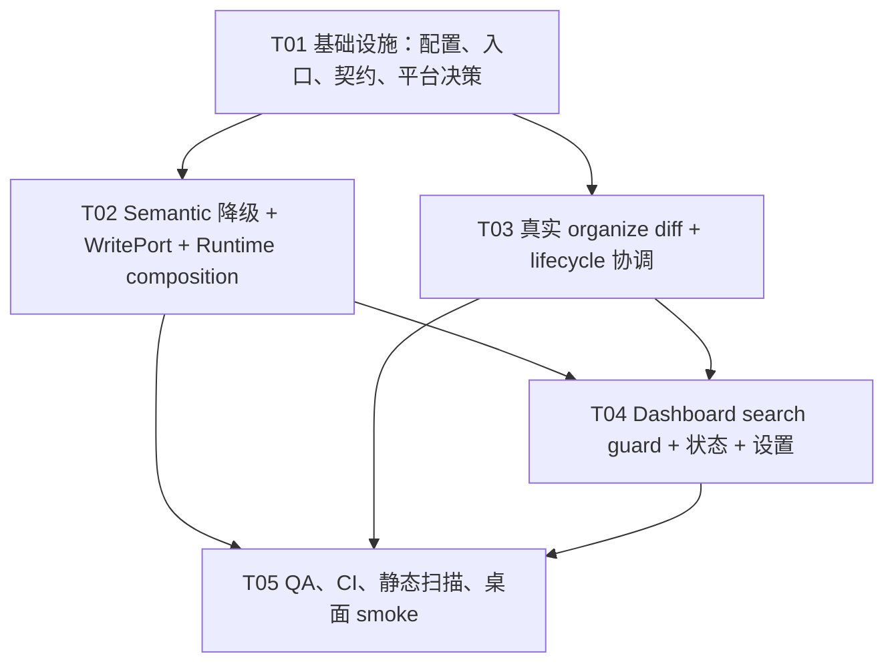

# 墨忆台 V0.2 Runtime Hardening 架构设计

> **文档性质：目标架构/历史基线。** 这里的“当前”指设计编写时点；scope 校验、CAS、`applying` 恢复、审计门禁等是目标约束，不等同于当前 `main` 已全部实现。当前状态见 [`AGENT-HANDOFF-PROMPT.md`](AGENT-HANDOFF-PROMPT.md)。

> 基线：`feat/memory-workbench-foundation` / `5586f4`  
> 范围：真实运行时接入、检索降级、索引生命周期并发、受控写入、整理 diff、搜索竞态、平台策略与质量门禁。  
> 事实源：Vault 中的 Markdown；索引、semantic 结果、proposal 和审计均为可追溯的派生数据。  
> 非目标：不重建 Demo、不接入 Hermes CLI、`child_process`、`spawn`、shell/terminal，不合并或推送。

## 1. 实现方案

### 1.1 核心技术挑战

1. **Composition root 缺少真实能力**：当前 `main.ts` 只注入关键词索引，`settings.featureFlags` 没有映射到 `SearchService`、`OrganizeService` 和 `WriteService`；WriteService 也没有真实 Obsidian `WritePort`。
2. **语义能力必须可选且安全降级**：semantic adapter、embedding provider 或网络可能不可用。启动不能因可选能力失败；关键词命中必须保留，响应要带 `degraded`、`semantic_unavailable` 和原因。
3. **rebuild 与增量事件竞态**：当前 rebuild promise 与按路径队列相互独立，旧 rebuild 可能在较新的 create/modify/delete/rename 后落地。需要 generation/version guard 和统一协调，失败时保留旧索引并显示 failed。
4. **四类整理动作必须生成真实 diff**：`OrganizeService.createChange` 目前 `before === after`、`diff === ''`。必须只对真实缺失项生成局部 after/diff；正文语义改写、删除和未知字段重排拒绝执行。
5. **异步搜索旧响应覆盖新响应**：Dashboard 输入 `a -> ab -> abc` 时，旧 Promise 可能晚返回。每次查询使用单调版本/token；关闭 View 后禁止更新 DOM。
6. **写入安全闭环**：所有新写入只能走 `WriteService -> WritePort -> Obsidian adapter`，并在写前重新读取、校验 scope/excludes、action whitelist、zone、before hash；写后计算 after hash、刷新索引和审计。冲突、刷新失败、审计失败均不能伪报成功。
7. **移动端声明与 Node API 冲突**：现有 `writeService.ts` 使用 `node:crypto`，`manifest.json` 却声明 `isDesktopOnly: false`。本 Sprint 采用 **A：明确 desktop-only**，避免在未验证的移动端运行时使用 Node API；未来若要支持移动端，再按 B 迁移到 Web Crypto adapter 并补真机测试。

### 1.2 架构与技术选择

- **架构模式**：Ports and Adapters（六边形）+ 轻量应用服务。`src/application` 定义契约、flags、RequestContext；`src/services` 编排业务；`src/ports` 定义外部能力；`src/adapters` 唯一接触 Obsidian API；`main.ts` 是唯一 composition root；View 只做 UI 生命周期、事件和打开原文。
- **平台**：保留 Obsidian Plugin API + TypeScript + esbuild + Node test runner，不引入 React/Vite/MUI 重建现有 Dashboard。原因是本仓库实际是 Obsidian 插件，成熟 UI 和测试已经可复用。
- **索引**：保留 `InMemoryVaultIndex` 作为当前可重建派生索引；通过 `IndexLifecycleService` 的 generation 协调 rebuild/incremental。未来 SQLite/FTS 或 embedding 只能实现现有 ports，不能成为事实源。
- **语义搜索**：新增可选 `SemanticSearchPort` adapter；默认使用 `UnavailableSemanticSearch` Null Object。`SearchService` keyword-first，只有配置开启、查询模式允许且关键词不足时才调用 semantic；semantic 失败则返回关键词结果和 degraded diagnostics。
- **写入**：新增 `ObsidianWritePort`，把 `App.vault.cachedRead`、受控 `modify`/原子替换能力封装在 port 后。当前 Obsidian API 不保证跨平台 rename 原子性，因此 adapter 以同一文件 `vault.modify` 为最小安全写入，并由 WriteService 做 hash/conflict 核验；不得从 View、AgentActionService 或 index 直接写 Vault。
- **Hash**：本 Sprint desktop-only，因此保留 SHA-256 `node:crypto` 在 hash utility 内，禁止业务服务使用其他 Node API。移动端 B 方案必须将此 utility 替换为注入式 `HashPort`（Web Crypto async 实现）。
- **测试**：保留 Node `node:test`、TypeScript、eslint；将所有 QA 专项纳入默认 `npm test`，增加 composition、semantic fallback、WritePort zero-write/conflict、organize diff、lifecycle race、dashboard search race 测试。真实 Obsidian smoke test 使用脱敏 Vault 和桌面手工/脚本验收记录，不依赖 shell 启动 Hermes。

### 1.3 不变量

- Markdown 是唯一事实源；任何索引/semantic/proposal/audit 丢失都可从 Vault 恢复或标为 pending。
- 默认新能力关闭：semantic search/fallback、organize actions、new write pipeline、auto-apply 均为 false；关闭后读路径行为保持兼容且写入次数为 0。
- `fiction`、`unknown` 永远 proposal-only；scope excludes 优先于 includes；白名单外 action 不产生可执行 change。
- 每个入口有一个根 `request_id`；子调用只使用 `context.child()`，不覆盖根 ID。
- 写入顺序固定：read current -> hash/scope/zone/action validation -> write -> read/hash after -> index refresh -> audit。任何异常显式返回状态。
- Proposal/approval apply 是 CAS/幂等操作：必须同时校验 `base_hash`（及可用时的 `base_revision`），同一 `proposal_id` 不得重复执行；状态只能按允许的状态机前进，终态不可重放。
- `APPLYING` 崩溃恢复默认为“未知结果/人工核验”：启动扫描将其 quarantine 或标记 `recovery_required`，绝不自动重放写入；只有读取当前文件并重新确认 hash、审批和策略后，用户显式 retry 才能继续。
- 高风险 apply 的审计是前置门禁：AuditSink/双写审计不可用时阻止进入 APPLYING，返回 `AUDIT_UNAVAILABLE`/`AUDIT_FAILED`，不得先写文件再补审计。

## 2. 文件列表

### 2.1 保留或修改

- `package.json`：默认测试包含 QA 专项；保持现有第三方依赖，不添加 Hermes/Node runtime 包。
- `tsconfig.json`：确认 desktop-only 下 Node 类型仅用于 hash utility；禁止把 Node API 扩散到 service/UI。
- `manifest.json`：将 `isDesktopOnly` 改为 `true`，并在描述/设置中明确桌面策略。
- `src/main.ts`：按 settings 组装 semantic、WritePort、WriteService、OrganizeService、AuditService、Lifecycle；订阅四类 Vault 事件。
- `src/settings.ts`：为 semantic、organize、new-write、auto-apply、platform strategy 提供持久化设置和说明。
- `src/application/contracts.ts`：补齐 runtime health、proposal/approval/audit、refresh pending、CAS/幂等、APPLYING 恢复和 quarantine 契约，保持既有类型兼容。
- `src/application/featureFlags.ts`：集中定义默认关闭和 flags -> search/write 配置映射。
- `src/application/requestContext.ts`：保持根/子 request context，供所有新入口使用。
- `src/ports/writePort.ts`：扩展 `read`, `writeAtomic`, 可选 `exists`/`recover` 语义；任何写操作最后一个参数为 context。
- `src/ports/semanticSearchPort.ts`：保持 health/search 契约，增加 provider/degraded 语义。
- `src/services/searchService.ts`：加强 semantic unavailable 安全降级和 config 映射。
- `src/services/indexLifecycleService.ts`：改为统一 coordinator + generation/version guard。
- `src/services/organizeService.ts`：实现四类真实局部变更与非空 diff。
- `src/services/writeService.ts`：只接受 WritePort，补齐策略、恢复和 audit/refresh 状态；hash 由注入式 utility/port 管理。
- `src/views/AgentDashboardView.ts`：搜索版本 guard、关闭 guard、模式/降级/索引状态和组织计划摘要。
- `src/services/auditService.ts`：保留 AuditSink 边界；失败转为 pending/failed，不吞异常。

### 2.2 新增

- `src/adapters/obsidianWritePort.ts`：真实 Obsidian Vault 读写 adapter，唯一实现 WritePort 的平台类。
- `src/adapters/unavailableSemanticSearch.ts`：semantic Null Object，health 为 unavailable，search 抛可识别 `SEMANTIC_UNAVAILABLE`。
- `src/services/runtimeComposition.ts`：可测试的 composition 工厂；`main.ts` 只负责加载 settings 和生命周期注册。
- `src/services/indexLifecycleCoordinator.ts`（或合并到 `indexLifecycleService.ts`）：统一 generation、事件队列、rebuild swap。
- `src/services/changeDiff.ts`：frontmatter/tag/link/format 四类纯函数 diff 生成器。
- `src/ports/hashPort.ts`：为 desktop SHA-256 和未来 mobile Web Crypto 提供替换边界。
- `src/ports/recoveryPort.ts`：扫描损坏/不完整 proposal 与 APPLYING 记录，执行 quarantine 和 recovery_required 标记；禁止自动 replay。
- `src/ports/proposalPort.ts`、`src/ports/approvalPort.ts`、`src/ports/recoveryPort.ts`：本 Sprint 预留 proposal/approval 状态迁移、CAS/幂等、损坏记录 quarantine/recovery_required 边界，不实现完整 UI。
- `tests/runtimeComposition.test.ts`、`tests/semanticFallback.test.ts`、`tests/obsidianWritePort.test.ts`。
- `tests/organizeDiff.test.ts`、`tests/indexLifecycleRace.test.ts`、`tests/dashboardSearchRace.test.ts`、`tests/proposalRecovery.test.ts`、`tests/auditGate.test.ts`。
- `.github/workflows/ci.yml`（若仓库已有 workflow 则修改现有文件）：test/build/typecheck/lint/diff check 和静态 Hermes 扫描。
- `docs/inkmemory/V0.2-RUNTIME-HARDENING-ARCHITECTURE.md`：本设计。
- `docs/inkmemory/V0.2-RUNTIME-HARDENING-CLASS-DIAGRAM.mermaid`、`docs/inkmemory/V0.2-RUNTIME-HARDENING-SEQUENCE-DIAGRAM.mermaid`：本设计图源。

## 3. 数据结构与接口

```mermaid
classDiagram
  class RequestContext {
    +string request_id
    +RequestActor actor
    +string created_at
    +string parent_request_id
    +child() RequestContext
  }
  class FeatureFlags {
    +boolean semantic_search
    +boolean semantic_fallback
    +boolean new_write_pipeline
    +boolean organize_auto_apply
    +boolean fiction_proposal_only
    +OrganizeFlags organize
  }
  class SearchConfig {
    +number keyword_min_results
    +number keyword_min_score
    +number keyword_weight
    +number semantic_weight
    +boolean semantic_search_enabled
    +boolean semantic_fallback_enabled
  }
  class SearchQuery {
    +string text
    +SearchMode mode
    +number limit
    +SearchScope scope
    +boolean force_semantic
  }
  class SearchResponse {
    +SearchResult[] results
    +SearchDiagnostics diagnostics
  }
  class SearchDiagnostics {
    +number keyword_count
    +number semantic_count
    +boolean semantic_called
    +boolean degraded
    +boolean semantic_unavailable
    +string fallback_reason
  }
  class SearchService {
    -IndexPort index
    -SemanticSearchPort semantic
    -SearchConfig config
    +query(request, context) Promise~LegacySearchResult[]~
    +search(query, context) Promise~SearchResponse~
  }
  class IndexPort {
    <<interface>>
    +search(text, options, context) Promise~IndexHit[]~
    +upsert(document, context) Promise~void~
    +invalidate(path, context) Promise~void~
    +buildAll(documents, context) Promise~void~
    +availability() string
  }
  class SemanticSearchPort {
    <<interface>>
    +health(context) Promise~Health~
    +search(query, context) Promise~SearchResult[]~
  }
  class UnavailableSemanticSearch {
    +health(context) Promise~Health~
    +search(query, context) Promise~SearchResult[]~
  }
  class NoteRecord {
    +string path
    +string content
    +Record~string,unknown~ frontmatter
    +string[] tags
    +string[] links
    +string hash
    +VaultZone zone
  }
  class PlannedChange {
    +string path
    +ChangeKind kind
    +string before
    +string after
    +string diff
    +string reason
    +FileChangeStatus status
    +string before_hash
    +VaultZone zone
  }
  class OrganizePlan {
    +string plan_id
    +string request_id
    +PlannedChange[] changes
    +SearchScope scope_snapshot
    +string created_at
  }
  class OrganizeService {
    -OrganizePort scanner
    -ScopeService scope
    -FeatureFlags flags
    +plan(scope, context) Promise~OrganizePlan~
    -createChange(note, kind) PlannedChange
  }
  class WriteRequest {
    +string path
    +string content
    +string before_hash
    +ChangeKind kind
    +SearchScope scope_snapshot
    +boolean dry_run
    +VaultZone zone
    +string request_id
  }
  class WriteResult {
    +string path
    +WriteStatus status
    +string before_hash
    +string after_hash
    +RefreshStatus refresh
    +ErrorCode error_code
  }
  class WritePort {
    <<interface>>
    +read(path, context) Promise~string~
    +writeAtomic(path, content, context) Promise~void~
  }
  class ObsidianWritePort {
    -App app
    +read(path, context) Promise~string~
    +writeAtomic(path, content, context) Promise~void~
  }
  class WriteService {
    -WritePort port
    -AuditSink audit
    -IndexLifecycleService lifecycle
    -FeatureFlags flags
    +write(request, context) Promise~WriteResult~
    -validate(request, current) ValidationResult
    -appendAudit(request, result, context) Promise~void~
  }
  class IndexLifecycleService {
    -VaultReaderPort reader
    -IndexPort index
    -number generation
    -Queue~LifecycleEvent~ queue
    -IndexLifecycleState state
    +rebuild(context) Promise~void~
    +create(path, context) Promise~void~
    +modify(path, context) Promise~void~
    +delete(path, context) Promise~void~
    +rename(oldPath, newPath, context) Promise~void~
    +getState() IndexLifecycleState
  }
  class ProposalRecord {
    +string proposal_id
    +string request_id
    +string target_path
    +string base_hash
    +string base_revision
    +string diff
    +ChangeKind kind
    +ProposalStatus status
    +boolean requires_approval
    +number apply_attempts
    +string recovery_state
  }
  class ApprovalRecord {
    +string approval_id
    +string proposal_id
    +ApprovalDecision decision
    +string decided_at
    +string approval_hash
  }
  class AuditEvent {
    +string request_id
    +string proposal_id
    +string path
    +string action
    +string before_hash
    +string after_hash
    +string result
    +string error_code
    +string created_at
  }
  class RecoveryRecord {
    +string proposal_id
    +RecoveryState state
    +string detected_at
    +string reason
    +boolean auto_replay
  }
  class ProposalPort {
    <<interface>>
    +save(proposal, context) Promise~void~
    +get(id, context) Promise~ProposalRecord~
    +transition(id, expected, next, context) Promise~void~
    +quarantine(id, reason, context) Promise~void~
  }
  class ApprovalPort {
    <<interface>>
    +record(approval, context) Promise~void~
    +isApproved(proposalId, context) Promise~boolean~
  }
  class AuditSink {
    <<interface>>
    +health(context) Promise~Health~
    +append(event, context) Promise~void~
    +query(filter, context) Promise~AuditEvent[]~
  }
  class AgentDashboardView {
    -number searchVersion
    -number lifecycleToken
    -boolean isClosed
    +loadKnowledgeResults() Promise~void~
    +onClose() Promise~void~
    +openKnowledgeResult(result) Promise~void~
  }
  class RuntimeComposition {
    +SearchService search
    +OrganizeService organize
    +WriteService write
    +IndexLifecycleService lifecycle
    +compose(app, settings) RuntimeServices
  }

  SearchService --> IndexPort
  SearchService --> SemanticSearchPort
  UnavailableSemanticSearch ..|> SemanticSearchPort
  OrganizeService --> NoteRecord
  OrganizeService --> PlannedChange
  WriteService --> WritePort
  ObsidianWritePort ..|> WritePort
  WriteService --> AuditSink
  WriteService --> IndexLifecycleService
  IndexLifecycleService --> IndexPort
  IndexLifecycleService --> RequestContext
  AgentDashboardView --> SearchService
  AgentDashboardView --> IndexLifecycleService
  RuntimeComposition --> SearchService
  RuntimeComposition --> OrganizeService
  RuntimeComposition --> WriteService
  RuntimeComposition --> ObsidianWritePort
  ProposalPort --> ProposalRecord
  ApprovalPort --> ApprovalRecord
  AuditSink --> AuditEvent
  ProposalRecord --> RecoveryRecord
```



### 3.1 关键语义

- `SearchService.search` 先执行 keyword；semantic 只在 `semantic_search_enabled` 且查询是 hybrid/semantic/force 或 keyword 不足时调用。semantic unavailable 时不吞掉 keyword 结果，返回 `degraded=true`；零 keyword 且 semantic 不可用时返回 `SEMANTIC_UNAVAILABLE`。
- `IndexLifecycleService` 为每次 rebuild/event 分配 generation。rebuild 在旁路集合中构建，只有 generation 仍为最新且事件水位未变化时才能 swap；否则丢弃旧结果并重试/补跑增量。失败保留旧索引，状态 `failed`。
- 四类 `changeDiff` 必须是纯函数：frontmatter-add 只插入缺失 key，tag-add 只补缺标签，bidirectional-link-add 只补缺少的 `[[target]]`，format-normalize 只修复约定的空白/换行格式。若 after 与 before 相同，返回 `null`；任何正文含义变化返回 `null` 或 `proposal_only`。
- `WriteService` 在 flags 关闭、dry-run、scope/excludes 拒绝、fiction/unknown、白名单拒绝时不调用 `WritePort.writeAtomic`（zero-write invariant）。before hash 冲突在写前返回 `conflict`，不得调用写接口。写成功后 refresh 失败返回 `failed` + `INDEX_REFRESH_FAILED`，但保留 Vault 写入和审计事实。
- proposal/approval 本 Sprint 只建立接口和状态兼容：`planned/proposal_only -> approved -> applying -> applied|conflict|failed|recovery_required`；每次 apply 使用 `proposal_id + base_hash/base_revision` 做 CAS，已成功/冲突/拒绝/隔离的终态不可重复执行。持久化双写、审批 UI、补偿队列、回滚产品属于 V0.3，但所有 apply 入口保留 `proposal_id`/`request_id` 扩展位。
- 高风险 apply 先调用 `AuditSink.health` 并写入可追踪的 intent/approval 事件；审计不可写直接阻止 APPLYING。进程在 APPLYING 期间崩溃时，启动恢复只将记录 quarantine/`recovery_required`，不自动重放；用户显式 retry 时重新读取当前 Markdown、重新计算 hash、验证 approval 和策略后才可尝试。

## 4. 程序调用流程

```mermaid
sequenceDiagram
  participant Obsidian as Obsidian Runtime
  participant Root as main.ts / RuntimeComposition
  participant Flags as settings + FeatureFlags
  participant View as AgentDashboardView
  participant Search as SearchService
  participant Index as IndexLifecycleService
  participant Keyword as IndexPort
  participant Semantic as SemanticSearchPort
  participant Org as OrganizeService
  participant Write as WriteService
  participant WP as ObsidianWritePort
  participant Audit as AuditSink

  Obsidian->>Root: onload()
  Root->>Flags: loadSettings()
  Root->>Root: map flags -> SearchConfig
  Root->>Semantic: construct optional adapter or UnavailableSemanticSearch
  Root->>WP: construct ObsidianWritePort(app)
  Root->>Index: construct lifecycle coordinator
  Root->>Search: construct(index, semantic, config)
  Root->>Org: construct(scanner, flags)
  Root->>Write: construct(writePort, audit, lifecycle, flags)
  Root->>Index: rebuild(ctx{request_id, actor=background-task})
  Index->>Index: snapshot generation and read Markdown list
  Index->>Keyword: buildAll(parsed documents, ctx.child())
  alt build success and generation current
    Keyword-->>Index: ready index
    Index-->>View: state=ready/count
  else rebuild failure or stale generation
    Index-->>View: state=failed or retry; old index retained
  end

  View->>View: input query; searchVersion += 1; capture token
  View->>Search: query({text, mode, limit}, ctx{request_id})
  Search->>Keyword: search(text, options, ctx)
  Keyword-->>Search: keyword hits
  alt keyword sufficient or semantic flag disabled
    Search-->>View: keyword results + diagnostics
  else semantic enabled and fallback needed
    Search->>Semantic: health/search(query, ctx.child())
    alt semantic available
      Semantic-->>Search: semantic hits
      Search-->>View: keyword-first hybrid results
    else semantic unavailable/error
      Semantic-->>Search: unavailable/error
      Search-->>View: keyword results + degraded reason
    end
  end
  View->>View: apply result only if token==searchVersion && !isClosed

  Obsidian->>Root: create/modify/delete/rename(path)
  Root->>Index: enqueue event with new generation and ctx
  Index->>Keyword: upsert/invalidate(event, ctx)
  Index-->>View: state/count refresh

  View->>Org: plan(scope, ctx)
  Org->>Org: scan notes and create actual before/after/diff
  Org-->>View: OrganizePlan (no-op omitted; fiction proposal-only)
  View->>Write: apply(proposalId, request, ctx) [only when flag/approval permits]
  Write->>Audit: health + append APPLY_INTENT (ctx.child())
  alt audit unavailable or proposal not approved/CAS already terminal
    Audit-->>Write: unavailable/rejected
    Write-->>View: AUDIT_UNAVAILABLE or IDEMPOTENT_NOOP; WP.writeAtomic never called
  else eligible apply
    Write->>WP: read(path, ctx.child())
    WP-->>Write: current Markdown + current hash/revision
    alt scope/zone/whitelist/base hash or revision conflict
      Write-->>View: skipped/proposal_only/conflict; WP.writeAtomic never called
    else transition APPROVED -> APPLYING
      Write->>WP: writeAtomic(path, after, ctx.child())
      WP-->>Write: success
      Write->>WP: read(path, ctx.child())
      WP-->>Write: after Markdown/hash
      Write->>Index: modify(path, ctx.child())
      alt refresh success
        Index-->>Write: ready
      else refresh failure
        Index-->>Write: failed/pending
      end
      Write->>Audit: append APPLY_RESULT with before/after hash
      Write-->>View: applied or failed-index-refresh result
    end
  end

  Obsidian->>Root: startup recovery scan
  Root->>Audit: health/query APPLYING records
  Root->>Root: quarantine as recovery_required; never auto-replay
  View->>View: onClose(); isClosed=true; lifecycleToken++
  Semantic-->>View: late response discarded by token/closed guard
```

### 4.1 CRUD 与恢复说明

- **Create/Modify/Delete/Rename**：均由 Obsidian vault events 转为 lifecycle event；rename 必须以 `invalidate(oldPath)` 再 `upsert(newPath)` 的一个协调事务处理，避免旧路径残留。
- **Rebuild**：读取 Markdown 快照并旁路构建；版本过期不 swap。失败保留上一个 ready index，UI 显示 failed/error，用户可重试。
- **Write/Apply**：仅 `WriteService` 能触发 adapter 写入；任何 `HASH_CONFLICT` 都零写入。索引刷新失败为 `failed/pending`，不能将 Vault 已写入伪装成完整成功。
- **Proposal/Approval**：本 Sprint 生成真实 diff 和 proposal-only 状态，保留审批/持久化 ports。V0.3 接入 Vault `_workbench/proposals`、`_workbench/approvals` 与本地目录双写，并以同一 request/hash 恢复；冲突时要求重新生成 proposal。
- **Audit/Recovery**：每次 intent/apply/conflict/failed/refresh-pending 都追加结构化审计；高风险 apply 前必须通过 AuditSink health 和 intent 落盘，审计端不可写则阻止 APPLYING，暴露 `AUDIT_UNAVAILABLE`/`AUDIT_FAILED`，不得先写文件再补审计。启动发现 `APPLYING` 记录时只 quarantine 并标记 `recovery_required`，不自动重放；显式 retry 必须重新校验当前 hash、base_revision、approval 和策略。回滚必须再次 hash 校验并复用 WriteService，禁止直接覆盖用户新内容。

## 5. Anything UNCLEAR（假设与待明确）

1. **Obsidian 原子写入能力**：当前 API 是否允许安全的临时文件 + rename 需要桌面 smoke test 确认。本设计以 `vault.modify` + 写前/写后 hash 作为最小可用 adapter；若平台确认支持 atomic rename，再在 adapter 内升级，不改变 WritePort。Obsidian `modify` 本身不提供跨进程 CAS，因此 base_revision 由 proposal/audit 记录维护，最终仍以当前 raw hash 为硬门槛。
2. **Semantic provider**：PRD 未指定 HTTP provider、embedding 模型或鉴权。只定义 `SemanticSearchPort`，本 Sprint 默认 unavailable；真实 provider 由后续 adapter 注入，禁止在 composition 启动时硬失败。
3. **Organize 规则细节**：frontmatter key、标签规范、双向链接目标推断、format-normalize 的格式规则尚未确定。架构要求每条规则是纯函数、可解释、可拒绝，工程实现使用现有契约测试驱动，不能猜测正文语义。
4. **Proposal/approval 持久化**：PRD 将完整审批、双写、补偿、回滚列为 V0.3；本 Sprint 仅保留接口、状态和 hash/request 关联，不能宣称完成审批产品。
5. **移动端策略**：本 Sprint 选择 A（desktop-only），因为现有 `node:crypto` 仍在写入 hash 路径且没有移动端运行验证。若产品必须保留移动端，应切换 B：`HashPort` + Web Crypto、移除 Node `Buffer`/crypto 依赖、`manifest=false`，并把移动端真机 smoke test 加入发布门槛。
6. **旧 AgentActionService**：视为 legacy/disabled 入口，不得被新 organize/write pipeline 复用。若未来要迁移 action，必须改为调用应用服务并携带 policy/proposal。
7. **CI/桌面 smoke**：仓库当前无明确 GitHub Actions 规范；设计要求新增/修改 workflow，但不把真实 Obsidian GUI 当作 CI 必过项，改用人工验收记录和 adapter contract tests。

## 6. Required Packages

不新增运行时第三方包，继续使用锁定依赖：

- `obsidian@latest`：插件宿主 API；仅限 adapter、View、settings 边界。
- `typescript@^5.8.3`：类型系统与 `tsc --noEmit`。
- `esbuild@0.25.5`：插件构建。
- `@types/node@^22.15.17`：desktop-only hash utility 的编译类型；禁止引入 `child_process`。
- `eslint@^9.39.4`、`typescript-eslint@^8.59.1`、`eslint-plugin-obsidianmd@^0.4.0`：静态检查。
- `@eslint/js@^9.39.4`、`globals@^17.6.0`、`jiti@^2.6.1`：现有 lint 配置。

## 7. Task List（按依赖顺序，最多 5 个）

### T01：项目基础设施与运行时契约（P0）

- **Source Files**：`package.json`、`tsconfig.json`、`manifest.json`、`src/main.ts`、`src/application/contracts.ts`、`src/application/featureFlags.ts`、`src/application/requestContext.ts`、`src/ports/hashPort.ts`、`.github/workflows/ci.yml`。
- **Dependencies**：无。
- **内容**：集中处理依赖声明、默认测试/CI 入口、desktop-only 平台决策、runtime composition 类型和 flags 映射边界。`main.ts` 建立可注入的 composition seam，但不在本任务实现各 adapter 细节。
- **验收**：配置文件不分散；默认 flags 全关闭；Manifest 与 Node API 策略一致；所有 API envelope/RequestContext/诊断字段向后兼容。

### T02：Semantic 降级与 Obsidian WritePort 运行时接入（P0）

- **Source Files**：`src/adapters/unavailableSemanticSearch.ts`、`src/adapters/obsidianWritePort.ts`、`src/ports/semanticSearchPort.ts`、`src/ports/writePort.ts`、`src/services/runtimeComposition.ts`、`src/services/searchService.ts`、`src/services/writeService.ts`、`src/services/auditService.ts`、`src/main.ts`、`tests/runtimeComposition.test.ts`、`tests/semanticFallback.test.ts`、`tests/obsidianWritePort.test.ts`。
- **Dependencies**：T01。
- **内容**：在真实 `main.ts` composition 注入 semantic adapter/config、Obsidian WritePort、WriteService、Audit 和 lifecycle；Unavailable Null Object 不阻塞启动；所有 write 入口验证 flags/zone/scope/action/hash，并保证 zero-write/conflict/after-hash/refresh 状态。高风险 apply 必须先审计健康检查和 intent 事件；以 `proposal_id + base_hash/base_revision` 做 CAS/幂等，APPLYING 崩溃记录只 quarantine/`recovery_required`，不自动重放。
- **验收**：默认启动不抛错；semantic 不可用时关键词仍可用并显示 degraded；flags 关闭或 hash conflict 时 adapter 写调用次数为 0；开启后唯一调用链为 WriteService -> WritePort -> Obsidian adapter；审计不可用时高风险 apply 不进入 APPLYING；同一 proposal 重复 apply 为幂等 no-op；恢复扫描不自动 replay APPLYING。

### T03：真实整理 diff 与索引生命周期协调（P0/P1）

- **Source Files**：`src/services/organizeService.ts`、`src/services/changeDiff.ts`、`src/services/indexLifecycleService.ts`、`src/services/indexLifecycleCoordinator.ts`、`src/adapters/in-memory-vault-index.ts`、`src/application/contracts.ts`、`tests/organizeDiff.test.ts`、`tests/indexLifecycle.test.ts`、`tests/indexLifecycleRace.test.ts`。
- **Dependencies**：T01；与 T02 仅共享 contracts，可并行实现，集成前需 T02 的 lifecycle 注入形状稳定。
- **内容**：实现四类白名单实际缺失检测和非空可读 diff；无变化过滤；fiction/unknown proposal-only；rebuild 与 create/modify/delete/rename 统一 generation/version guard，失败保留旧索引并暴露 failed 状态。
- **验收**：四类动作分别产生预期 after/diff；正文语义修改拒绝；任意乱序 rebuild/增量事件最终与 Vault 最新内容一致；旧 rebuild 不能回退索引；损坏 proposal 被 quarantine 且恢复跳过，不自动重放 APPLYING。

### T04：Dashboard 搜索竞态、状态呈现与设置 UI（P1）

- **Source Files**：`src/views/AgentDashboardView.ts`、`src/settings.ts`、`src/data/dashboardTypes.ts`、`src/services/dashboardService.ts`、`src/services/scopeService.ts`、`styles.css`、`tests/dashboardSearchRace.test.ts`、`tests/v02SearchAndOrganize.test.ts`。
- **Dependencies**：T01、T02、T03。
- **内容**：为每次搜索维护单调 `searchVersion`/token 和 View `lifecycleToken`；迟到响应、关闭后的响应不更新 DOM；展示 keyword/hybrid/semantic、degraded reason、索引 rebuilding/ready/failed；设置页映射 semantic/organize/new-write/auto-apply 开关并可回退。
- **验收**：`a/ab/abc` 乱序响应最终只显示 abc；关闭 View 后无 DOM 更新；settings 保存后下一次 composition 生效；默认关闭时行为和旧 Dashboard 一致。

### T05：全量质量门禁与桌面验收（P0/P1）

- **Source Files**：`package.json`、`.github/workflows/ci.yml`、`tests/v02QaGaps.test.ts`、`tests/v02QaWrite.test.ts`、`tests/portsContract.test.ts`、`tests/requestContext.test.ts`、`tests/readonlyIndex.test.ts`、`tests/searchService.test.ts`、`tests/indexLifecycle.test.ts`、`tests/runtimeComposition.test.ts`、`docs/inkmemory/V0.2-RUNTIME-HARDENING-ARCHITECTURE.md`。
- **Dependencies**：T02、T03、T04。
- **内容**：把 QA 专项纳入默认 `npm test`/CI；增加静态扫描确保无 Hermes/child_process/spawn/shell；执行 typecheck/build/lint/diff check；准备脱敏 Vault 的 Obsidian desktop smoke checklist（启动、rebuild、四事件、搜索、打开原文、失败 rebuild、semantic unavailable、zero-write/conflict）。
- **验收**：`npm test`（含 QA）、`npm run build`、`npm run lint`、`npx tsc --noEmit`、`git diff --check` 全通过；新增 CAS/幂等、APPLYING quarantine/no-replay、损坏记录跳过、audit-unavailable block 测试；P0 安全验收失败不得发布；不得提交 `.workbuddy/`、`overview.md`、handoff 辅助文件。

## 8. Shared Knowledge

- 统一响应 `{code, data, message, request_id?}`；业务错误不得只返回字符串。
- 所有操作入口先创建一个根 `RequestContext`；子服务使用 `context.child()`，审计、写入、索引和 semantic 调用必须能追溯同一根 request。
- 所有日期为 ISO 8601 UTC；Vault 路径使用规范化相对路径，大小写/分隔符处理必须稳定。
- Markdown 是唯一事实源。索引和 semantic 是可重建派生数据，不能直接“修复”或覆盖 Vault。
- 写入只允许 `WriteService -> WritePort -> Obsidian adapter`；View、Dashboard、AgentActionService、Index adapter 不得写 Vault。
- flags 默认关闭；关闭新写管线必须 zero-write，并回退到旧读路径。`fiction`/`unknown` 为 proposal-only；excludes 优先；白名单只有四类 change kind。
- apply 必须校验当前 hash；`HASH_CONFLICT` 立即停止且原文不变。成功返回 `after_hash`；索引刷新失败返回 `INDEX_REFRESH_FAILED`/pending，不能伪报完整成功。
- semantic 失败不阻断启动；关键词命中优先，语义结果去重并标注来源；无关键词且 semantic unavailable 才返回明确错误。
- lifecycle 事件必须包含 create/modify/delete/rename 四类；rebuild 采用旁路构建和 generation guard，失败保留旧 ready index。
- Dashboard 任何异步更新都校验 `searchVersion`/`lifecycleToken` 和 `isClosed`；迟到响应只记录诊断，不碰 DOM。
- 禁止 Hermes、`node:child_process`、`spawn`、shell、terminal；不得合并/推送。旧 `AgentActionService` 仅作为 legacy/disabled 路径。
- Proposal/approval/audit/recovery 的完整双持久化和 UI 属于 V0.3；本 Sprint 仍必须保留端口、状态、hash、request_id 扩展位，不得为绕过未来审批而新增直写路径。

## 9. Task Dependency Graph



## 10. 风险与发布门槛

| 风险 | 等级 | 缓解 |
|---|---:|---|
| Runtime composition 漏注入导致真实能力仍不可用 | 高 | `runtimeComposition.test.ts` 断言 flags、semantic、WriteService、WritePort 均从 settings 组装；启动时 Null Object 降级 |
| 写入绕过 WriteService 或旧 Agent 路径写 Vault | 高 | adapter contract/zero-write 测试；静态扫描禁止 service/View 直接调用写 API；legacy 路径显式 disabled |
| rebuild 竞态回退索引 | 高 | generation + event watermark；旁路 build/swap；乱序测试；失败保留旧索引 |
| diff 生成器误改正文/未知 frontmatter | 高 | 纯函数、四类白名单、after===before 过滤、解析异常 proposal-only；逐类 golden tests |
| semantic provider 失败阻断插件 | 高 | 默认关闭 + UnavailableSemanticSearch；keyword-first degraded response |
| Node API 在移动端崩溃 | 高 | 本 Sprint manifest desktop-only；未来 B 迁移必须使用 HashPort/Web Crypto 并做真机验证 |
| 写后索引刷新失败误导用户 | 中 | `RefreshStatus.failed/pending`、审计保留写入事实、UI 显示重试；不得返回完整 succeeded |
| 搜索迟到响应污染 UI | 中 | 单调 searchVersion + lifecycleToken + isClosed 三重守卫，新增乱序测试 |
| CI 漏测 QA 专项 | 中 | 默认 test script 和 workflow 显式列出所有测试文件；发布门槛含 typecheck/build/lint/diff check |
| proposal/审计持久化边界被误宣称完成 | 中 | 文档明确 V0.3；本 Sprint 只交付端口/状态/审计事件和恢复语义，不交付完整审批 UI |

### 发布门槛

1. P0：默认设置下插件、Dashboard、旧快捷操作和关键词搜索正常；semantic/adapter 不可用不阻塞启动。
2. P0：新写入 flags 关闭时 zero-write；开启后只能经 WriteService/WritePort；四类 diff、scope/excludes、fiction/unknown、hash conflict 均通过测试。
3. P0：真实桌面完成启动 -> rebuild -> create/modify/delete/rename -> 搜索 -> 打开原文；失败 rebuild 能继续搜索旧索引。
4. P1：rebuild/event 和 search race 测试通过；移动端策略与 manifest 一致；所有 lint warning 分类且无新增 error。
5. 未完成 proposal/approval 双持久化或 Hermes 集成不影响本 Sprint 交付，但不得以此宣称 V0.3/V0.4 已完成。
