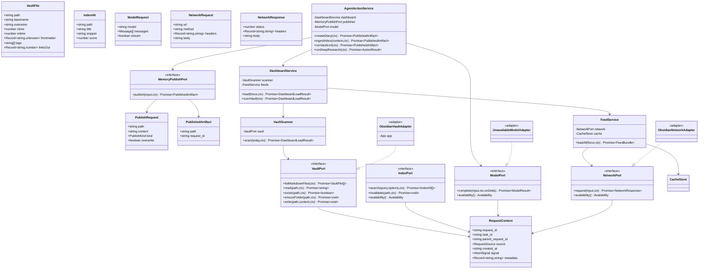
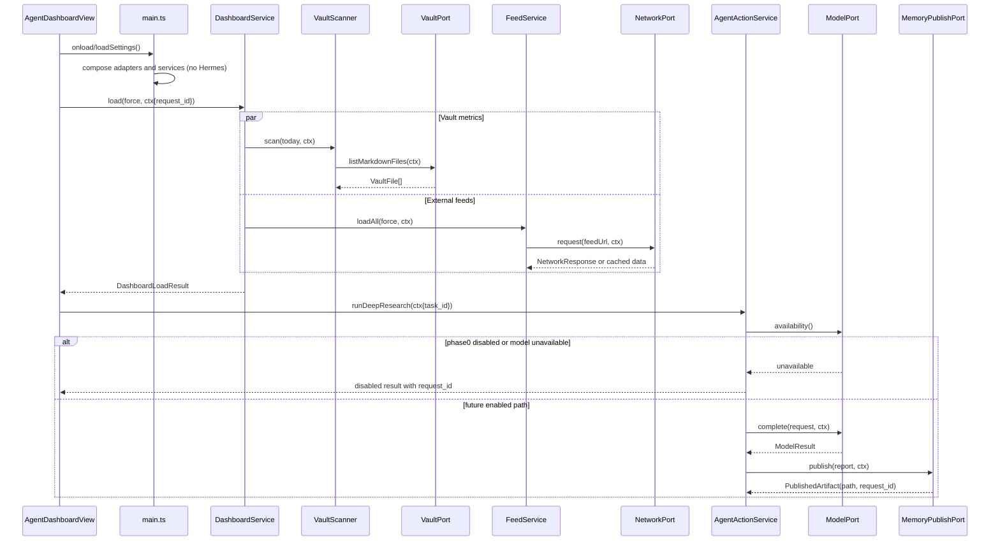
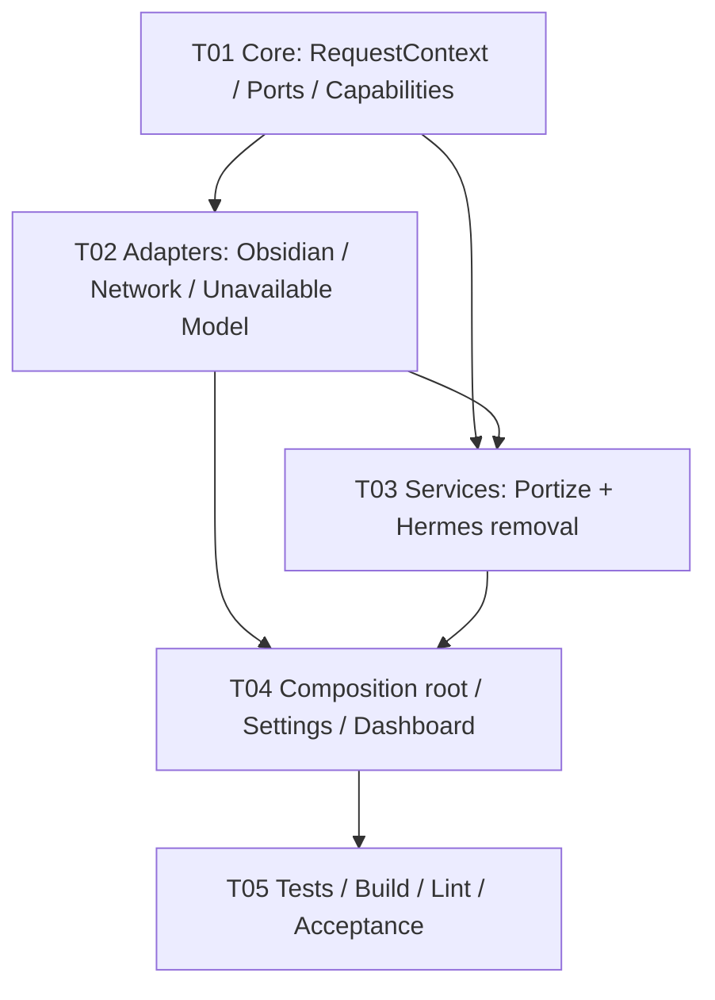

> **历史文档说明**：本文是「阶段 0」的原始设计稿。最终实现已落地并略有调整——端口在 `src/ports/`、适配器在 `src/adapters/`、应用契约在 `src/application/`（原计划中的 `src/core/` 目录已拆分）。记忆系统的 4 层架构、存储布局与调度语义见 [`docs/memory-architecture.md`](memory-architecture.md)。

# 阶段 0 系统设计：端口化边界与 Hermes 移除

## 1. 实现方案

### 技术难点

1. 当前 `main.ts` 将 `App` 直接传入 `DashboardService`、`AgentActionService`，服务层进一步直接使用 Obsidian API。
2. `AgentActionService` 动态加载 `node:child_process` 并执行 Hermes，导致运行时依赖 Node/桌面环境；这必须彻底从运行依赖图移除。
3. `ChatService`、`FeedService` 直接使用 `fetch`/`requestUrl`，无法在不依赖外部网络实现的情况下测试。
4. 需要为 UI 操作、任务、Vault 写入和发布操作提供一致的 `request_id`，同时不改变现有 Dashboard 外壳及默认加载行为。

### 分层与框架选择

- 保留现有 Obsidian Plugin API、TypeScript、Node test runner 和 esbuild，不引入新运行时框架。
- 采用 Ports and Adapters（六边形）结构：`core` 仅定义请求上下文、端口和能力；`services` 为业务层；`adapters` 是唯一允许接触 Obsidian、网络客户端的基础设施层；`main.ts` 是组合根。
- 阶段 0 的 `ModelPort` 使用不可用适配器，之后可替换为 HTTP/Ollama 实现；不恢复 Hermes。
- `IndexPort` 可包装现有关键词算法，但不扩展为完整 Vault 搜索。
- Dashboard View 保留现有 ItemView 和视觉结构。View 仅负责 UI 生命周期、事件和 Obsidian workspace 操作，业务服务不接收 `App`。

### Hermes 隔离策略

- 删除 `agentActionService.ts` 中 `Platform`、`node:child_process`、`spawn` 及 Hermes 路径调用。
- `hermesPath` 旧设置可兼容读取但不得显示、执行或注入服务；保存时不再依赖它。
- `phase0ActionsEnabled` 默认 `false`。受模型/Hermes 保护的操作点击时返回带 `request_id` 的 disabled 结果或错误，Dashboard 启动、刷新、渲染不受影响。
- 在无网络、Index/Model 不可用时，适配器返回可识别的 unavailable 状态；数据源失败继续使用缓存/空数据。

## 2. 文件列表

### 新增

- `src/core/requestContext.ts`：创建根请求上下文和子任务上下文。
- `src/core/ports.ts`：Vault、Index、Model、Network、MemoryPublish 端口及数据类型。
- `src/core/capabilities.ts`：阶段 0 能力开关、disabled 结果和错误。
- `src/adapters/obsidianVaultAdapter.ts`：Obsidian Vault API 到 `VaultPort` 的实现。
- `src/adapters/obsidianIndexAdapter.ts`：关键词索引适配器或 unavailable 实现。
- `src/adapters/obsidianNetworkAdapter.ts`：唯一持有 `requestUrl` 的网络适配器。
- `src/adapters/obsidianMemoryPublishAdapter.ts`：Vault 文件发布/写入实现。
- `src/adapters/unavailableModelAdapter.ts`：安全的默认模型适配器。
- `tests/requestContext.test.ts`、`tests/portsContract.test.ts`、`tests/hermes-disabled.test.ts`：契约、追踪和 Hermes 静态依赖测试。

### 修改

- `src/main.ts`：仅负责 settings 加载和 composition root，不再注入 Hermes path 或向业务服务传入 `App`。
- `src/settings.ts`：移除 Hermes UI 设置；增加隐藏/内部的 `phase0ActionsEnabled=false` 兼容设置。
- `src/services/agentActionService.ts`：改依赖端口，所有操作接收 `RequestContext`，删除 Hermes。
- `src/services/dashboardService.ts`、`src/services/vaultScanner.ts`：改依赖端口，不接收 `App`。
- `src/services/cacheStore.ts`、`src/services/feedService.ts`：分别改依赖 `VaultPort`、`NetworkPort`，透传上下文。
- `src/services/vaultContext.ts`、`src/services/chatService.ts`：搜索和模型调用改走 `IndexPort`、`ModelPort`。
- `src/views/AgentDashboardView.ts`：动作入口生成上下文，保留原有壳与按钮；View 自身的 workspace/modal 访问暂属于 UI 边界。

### 暂不修改

`src/data/dashboardTypes.ts`、`src/services/dashboardMath.ts`、`src/services/rssParser.ts`、样式、manifest 和 esbuild 配置，除非类型契约需要最小兼容调整。

## 3. 数据结构与接口

所有端口的 `ctx` 是最后一个必填参数；端口不得自行生成替代的请求 ID。时间统一使用 ISO 8601 UTC。`Availability` 为 `ready | unavailable`，不可用能力不得在 composition 阶段抛错。

## 4. 程序调用流程

CRUD/写入路径：`createDiary`、`ingestInbox`、`runVaultLint` 均由 View 生成 `ctx`，经 `AgentActionService` 调用 `MemoryPublishPort.publish`；读取路径经 `VaultPort`；外部读取经 `NetworkPort`。聊天同样必须把上下文传入 `IndexPort` 和 `ModelPort`，不能直接使用 HTTP 客户端。

## 5. 不明确事项与假设

- “功能开关关闭时行为不变”解释为 Dashboard 数据、视觉壳、导航、刷新和缓存行为不变；受保护动作点击时明确提示未启用，不执行 Hermes。
- 历史 `hermesPath` 是否从已保存数据彻底删除尚未确认。默认仅停止读取/显示，以免破坏兼容数据。
- 阶段 0 的 `IndexPort` 只包装现有关键词算法或返回 unavailable，不实现完整 Vault 搜索。
- View 内部仍可调用 Obsidian workspace/modal API；若要求连 View 也不得接触 Obsidian，需要额外的 `ViewHostPort`，不纳入本阶段。
- 网络请求失败继续使用缓存或空列表，避免外部服务影响插件启动。

## 6. Required Packages

不新增运行时第三方包，继续使用现有依赖：

- `obsidian@latest`：插件宿主类型与 API（仅 adapter/UI 边界）
- `typescript@^5.8.3`：类型检查
- `esbuild@0.25.5`：插件构建
- `@types/node@^22.15.17`：现有编译类型；阶段 0 不再运行时导入 Node child_process
- `eslint@^9.39.4`、`typescript-eslint@^8.59.1`：静态检查

## 7. 任务列表（按依赖排序）

### T01：项目基础设施与请求上下文（P0）
- Source Files：`src/core/requestContext.ts`、`src/core/ports.ts`、`src/core/capabilities.ts`、`package.json`、`tsconfig.json`、`tests/requestContext.test.ts`
- Dependencies：无
- 内容：定义上下文、五类端口、能力结果和测试入口；配置变更必须集中在本任务。

### T02：平台与外部适配器（P0）
- Source Files：`src/adapters/obsidianVaultAdapter.ts`、`src/adapters/obsidianIndexAdapter.ts`、`src/adapters/obsidianNetworkAdapter.ts`、`src/adapters/obsidianMemoryPublishAdapter.ts`、`src/adapters/unavailableModelAdapter.ts`、`tests/portsContract.test.ts`
- Dependencies：T01
- 内容：封装 Obsidian、网络、索引和不可用模型；业务层不得再直调平台 API。

### T03：业务服务端口化与 Hermes 删除（P0）
- Source Files：`src/services/agentActionService.ts`、`src/services/dashboardService.ts`、`src/services/vaultScanner.ts`、`src/services/cacheStore.ts`、`src/services/feedService.ts`、`src/services/vaultContext.ts`、`src/services/chatService.ts`
- Dependencies：T01、T02
- 内容：移除 `App`、`fetch`、`requestUrl`、`node:child_process` 依赖；所有业务调用携带 `RequestContext`。

### T04：组合根、设置与 Dashboard 集成（P0）
- Source Files：`src/main.ts`、`src/settings.ts`、`src/views/AgentDashboardView.ts`、`src/data/dashboardTypes.ts`
- Dependencies：T02、T03
- 内容：构造适配器和服务，默认关闭阶段 0 能力，保留 Dashboard 外壳和 action labels。

### T05：回归测试、清理与验收（P0）
- Source Files：`tests/hermes-disabled.test.ts`、`tests/dashboardMath.test.ts`、`tests/portsContract.test.ts`、`package.json`、`src/main.ts`
- Dependencies：T04
- 内容：静态 Hermes 扫描、request_id 传播、无网络/无模型启动、Dashboard 行为回归；运行 `npm test`、`npm run build`、`npm run lint`。

## 8. Shared Knowledge

- 所有入口操作先创建 `RequestContext`；所有下游端口必须透传同一个 `request_id`。
- 写入/发布结果必须包含 `request_id` 和最终路径；错误至少携带 `request_id`、`task_id`。
- 时间字段统一 ISO 8601 UTC；本地展示可在 UI 层格式化。
- 服务层不能导入 `obsidian`、`node:child_process`、`fetch` 或 `requestUrl`。
- `main.ts` 是唯一组合根；适配器持有平台依赖；不可用能力使用 Null Object，不在启动时抛出异常。
- 阶段 0 不进行 Vault 全功能搜索、不重写既有 Markdown、不引入 V0.4；缓存文件格式和 Dashboard 数据结构保持兼容。

## 9. 任务依赖图

## 10. 回滚与验收

### 回滚

- T01–T04 分别独立提交；先回滚 T04 组合根，再回滚 T03 业务迁移，保留端口类型文件。
- 绝不恢复 Hermes 动态 import；若适配器不稳定，切换至 unavailable adapter，确保插件仍能启动。
- 旧 `hermesPath` 数据保留但不读取；缓存格式和 Dashboard 数据模型不回滚变更。

### 验收标准

1. 全仓业务服务没有 `node:child_process`、`spawn`、`fetch`、`requestUrl`；Hermes 不存在于运行依赖图。
2. 无 Hermes、无网络、Index/Model unavailable 时 `onload` 成功，Dashboard 仍可加载、刷新和渲染。
3. 每个入口操作携带 `request_id`；所有 Vault 写入和 Memory publish 带上下文并返回可追踪结果。
4. Dashboard 外壳、导航、按钮标签、统计和缓存行为保持兼容；受保护动作仅反馈未启用。
5. 不实现完整搜索、不自动改写既有 Markdown、不引入 V0.4；`npm test`、`npm run build`、`npm run lint` 全部通过。
